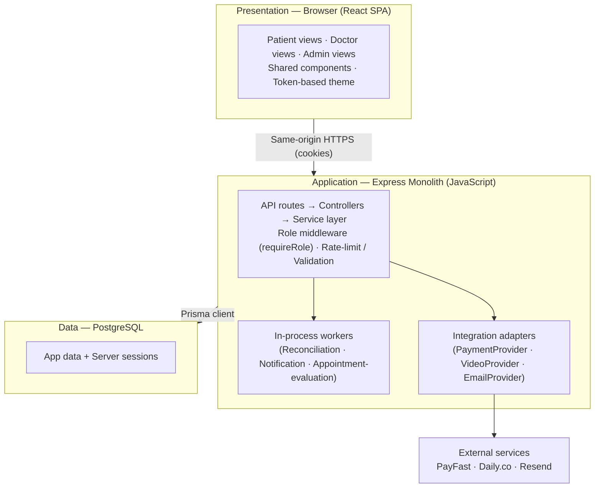
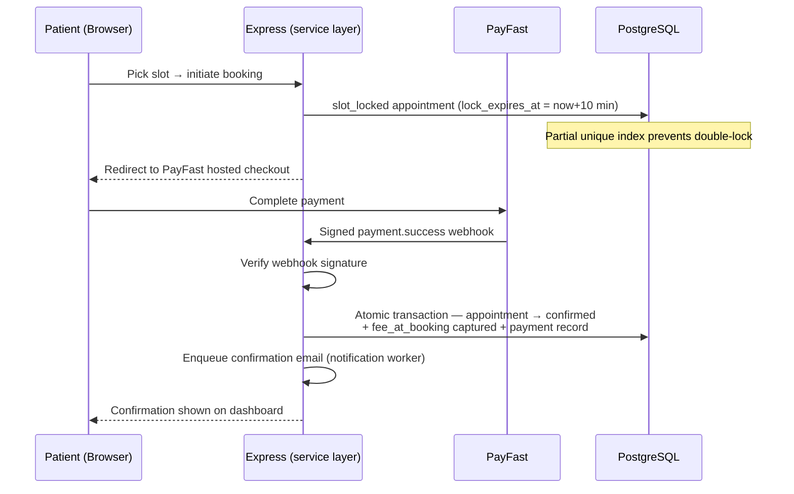

# 03 — Architecture Document

| Field                | Value                              |
| -------------------- | ---------------------------------- |
| **Document ID**      | 03-ARCHITECTURE_DOCUMENT           |
| **Status**           | Canonical                          |
| **Version**          | 1.6                                |
| **Last updated**     | 2026-06-13                         |
| **Sources absorbed** | `docs/engineering/ARCHITECTURE.md` |
| **Related docs**     | 02, 04, 05, 10, 14, 15             |

---

## Index

1. [High-level architecture](#1-high-level-architecture)
2. [Technology stack](#2-technology-stack)
3. [Data flow diagrams](#3-data-flow-diagrams)
4. [Integration points](#4-integration-points)
5. [Deployment architecture](#5-deployment-architecture)
6. [Evolution direction](#6-evolution-direction)

---

## Purpose

This document defines how Dermestha v1 is wired: the structural decisions, technology stack, runtime data flows, external integrations, and deployment topology. Visual and theming decisions are owned by `DESIGN.md` and are not re-decided here.

---

## 1. High-level architecture

Dermestha v1 is a **single-deployable, same-origin monolith**: one JavaScript Express application that exposes a JSON API and serves the built React (Vite) single-page app from the same origin (no CORS). Business logic lives in a **service layer** (`model → controller → service`); a single **role middleware** is the server-side authorization boundary. Three **in-process background workers** advance time-based state. Three **external integrations** each sit behind a thin **adapter interface** so a vendor can be swapped without touching business logic.

**Components:**

- **Web client** — All three surfaces (patient / doctor / admin); discovery, booking, payment handoff, video, dashboards, prescription render. React + Vite (JavaScript + JSDoc), token-based CSS.
- **API + app core** — JSON API, service-layer business logic, state machine, invariants, authorization. Node + Express (JavaScript + JSDoc), Prisma.
- **Database** — Durable store for all domain data and server sessions. PostgreSQL (managed).
- **Reconciliation worker** — Hourly query of PayFast for unconfirmed payments; reconcile missed webhooks. `node-cron` (in-process). (PayFast Pakistan exposes no status-query API → the query returns `unknown` and the worker surfaces stuck payments once for manual review; ADR-32.)
- **Notification worker** — Schedule and dispatch the 6 email triggers; retry/backoff; reminder invalidation. `node-cron` (in-process).
- **Appointment-evaluation worker** — Advance `confirmed→in_progress`, resolve `completed`/no-show within the grace window. `node-cron` (in-process). **Now implemented** (`server/src/workers/`; `evaluateDueAppointments` in `server/src/modules/appointment/service.js`; ADR-25): owns all non-payment §4.3 transitions (`confirmed→in_progress` at slot-start; `in_progress→completed` at slot-end+5m; no-show resolution at slot+15m with doctor-absence precedence per ADR-12).
- **Payment adapter** — Hosted checkout; dual-channel confirmation (signed `CHECKOUT_URL` callback + browser return) verify; refund + status-query degrade to a manual admin path for PayFast Pakistan (no vendor API; ADR-32). PayFast Pakistan.
- **Video adapter** — Per-appointment rooms, time-bound participant tokens. Daily.co.
- **Email adapter** — Transactional sends + bounce/failure signal. Resend.

---

## 2. Technology stack

| Decision              | Choice                                                                                                               | Rationale                                                                                                                                                                                                                                                                                                               |
| --------------------- | -------------------------------------------------------------------------------------------------------------------- | ----------------------------------------------------------------------------------------------------------------------------------------------------------------------------------------------------------------------------------------------------------------------------------------------------------------------- |
| **Language**          | JavaScript end-to-end (ES modules), with `// @ts-check` + JSDoc type hints                                           | No build/transpile step and no `tsconfig`. JSDoc + `@ts-check` (via a `jsconfig.json`) gives editor-level type-checking on the risky invariant modules — the state machine, slot-lock, refund math — without committing to TypeScript. Prisma's generated client still surfaces model types through JSDoc/editor hints. |
| **App framework**     | Node + Express monolith, `model → controller → service`                                                              | Team expertise; serves the SPA same-origin → satisfies no-CORS requirement, one domain, cookie auth just works.                                                                                                                                                                                                         |
| **Frontend**          | Vite + React (JS) SPA, served by Express `static`                                                                    | Fast builds; one deployable; host-agnostic. SSR not needed at this scale (TTFB met via region + static serving + code-splitting). Client state: React Context (session) + TanStack Query (server cache), per ADR-20. Server uses `date-fns-tz` for Asia/Karachi↔UTC slot math (ADR-21).                                                                                                                                                                                       |
| **Styling / theming** | Reuse the mockups' CSS-variable tokens (`tokens.css` + `components.css`); React components wrap existing BEM classes | CSS custom properties give the most manageable theming (one var → app-wide reskin) and are pixel-faithful to the approved mockups. MUI rejected: imposes Material look conflicting with the flat/squared design and adds bundle weight.                                                                                 |
| **Database**          | PostgreSQL + Prisma                                                                                                  | Relational, integrity-heavy, join-heavy data; native `UNIQUE`/FK/transactions satisfy data-integrity invariants directly; cleanest AWS path (RDS/Aurora).                                                                                                                                                               |
| **Sessions / auth**   | Hand-rolled cookie sessions — `express-session` + `connect-pg-simple` + `argon2` + `express-rate-limit`              | PRD mandates HTTP-only session cookies (not JWT). Auth has bespoke rules; hand-rolling fits the service layer and makes per-event audit-logging trivial, with fewest dependencies.                                                                                                                                      |
| **Hosting**           | Railway all-in-one (app + Postgres), Mumbai/Singapore region                                                         | Simplest managed setup; private app↔DB networking; always-on for webhooks/cron; under ~USD 50/mo budget.                                                                                                                                                                                                                |
| **Email**             | Resend (free tier)                                                                                                   | Free at ~2–3k/mo; bounce/complaint webhooks satisfy notification requirements.                                                                                                                                                                                                                                          |
| **Video**             | Daily.co (behind adapter)                                                                                            | Least development; room + time-bound token primitives map 1:1 to requirements; cost scales with paid consults.                                                                                                                                                                                                          |
| **Payments**          | PayFast (behind adapter)                                                                                             | Most established PK aggregator (first SBP commercial license, APPS-backed, PCI-DSS); one integration + KYC covers cards + JazzCash + Easypaisa + bank; hosted checkout, signed callback/return IPN. PayFast **Pakistan** exposes no programmatic refund or status-query API → those degrade to a manual admin path (ADR-32).                                                                                          |
| **Scaffold**          | Lean scaffold, no third-party boilerplate                                                                            | No maintained boilerplate matches Express + React-SPA + Prisma + cookie-session RBAC; official Vite `react` + a clean Express/Prisma backend is lower-effort and better-fit. Borrow only config (Dockerfile, ESLint/Prettier/Husky/Zod).                                                                                |
| **File-upload middleware** | `multer` `^2.1.1` (`memoryStorage`, 2 MB hard cap)                                                              | Multipart parsing for the doctor profile-photo pipeline (Slice G F10). In-memory buffer lets the service magic-byte validate before persisting to the uploads volume; the 2 MB cap bounds request size.                                                                                                                |

---

## 3. Data flow diagrams

### 3a. Three-layer architecture

### 3a.1. Code organization & folder conventions

The three logical layers above (routes → controllers → services) are organized **feature-first**, not in top-level `routes/`/`controllers/`/`services/` directories (ADR-26). The physical layout:

**Server (`server/src/`):** each domain is a self-contained module — `modules/<domain>/` with `index.js` (routes), `controller.js`, `service.js`, and a co-located `test.js` — for `auth`, `doctor` (incl. availability), `appointment` (the whole booking → cancellation → refund → evaluation lifecycle in one `service.js`), `payment`, `video`, and `admin` (records, audit, alerts, settings, and the doctor-management write paths; Slice G). A central `routes.js` (`registerRoutes`) mounts every module. Cross-cutting infrastructure stays top-level and folder-grouped: `config/` (flat `constants.js`), `http/` (flat `AppError.js`), `lib/<name>/<name>.js`, `middleware/<name>/<name>.js`, `integrations/`, `workers/`, plus shared cross-module services in `services/` (today: `audit/`). `health/` and `dev/` are standalone.

**Client (`client/src/`):** each feature is `modules/<feature>/` with `views/<View>/`, feature-local `components/`, **one `use<Feature>` hook** owning the feature's data/mutations (views keep render + pure UI state only), and a `*.routes.jsx`. Cross-feature UI primitives live in `shared/<Name>/`; cross-cutting React state in `context/` (`context/session/` for session state; `context/AppProviders.jsx` composing Query + Router + Session providers); pure utilities in `lib/<name>/<name>.js`; page shells in `layouts/<Name>/`. `routes.jsx` aggregates each module's routes via `buildRoutes(session)` and `App.jsx` renders only the route table. One-shot auth actions live in `modules/auth/useAuth.js`; the session **context holds cross-cutting state only**.

**Shared (`shared/schemas/`):** Zod request DTOs are the client↔server validation contract, organized per-domain (`auth/`, `doctor/`, `appointment/`) behind an `index.js` barrel.

**Data layer — Prisma vs Zod.** There is no Mongoose-style model file: `prisma/schema.prisma` is the single declarative model (`prisma generate` → typed client, accessed via the `lib/prisma/` singleton), with model-shape safety at edit-time (`@ts-check` + JSDoc) plus DB constraints; `shared/schemas/*` (Zod) validate incoming HTTP requests at the API boundary. They overlap in fields but are intentionally distinct (e.g. Zod `password` → Prisma `passwordHash`). Generating Zod from Prisma is a possible future improvement, out of scope.

### 3b. Booking → Payment → Confirmation sequence

### 3c. Core business process flows

---

## 4. Integration points

Three external services, each behind a thin adapter interface:

- **PayFast (payment adapter)** — Hosted checkout handoff; dual-channel confirmation (signed `CHECKOUT_URL` callback + browser `SUCCESS_URL`/`FAILURE_URL` return) verified on success/failure. PayFast **Pakistan** exposes no refund or status-query API → refunds settle via an admin out-of-band action keyed by `refund_idempotency_key` and reconciliation surfaces stuck payments for manual review (ADR-32). Accessed only through the `PaymentProvider` adapter interface (`server/src/integrations/payment/`). Detailed payload contracts and field descriptions live in doc 14.
- **Daily.co (video adapter)** — One room per appointment; time-bound meeting tokens scoped to the slot window; browser-only join; participant join/leave events feed the appointment-evaluation worker. Accessed only through the `VideoProvider` adapter interface (`server/src/integrations/video/`). Detailed contracts live in doc 14.
- **Resend (email adapter)** — The 6 transactional email triggers; bounce/complaint webhooks; retry/backoff managed by the notification worker. No PDF attachments in v1. Accessed only through the `EmailProvider` adapter interface (`server/src/integrations/email/`). The 6-email merge-variable catalog and trigger conditions live in doc 14.

There are no message queues or other third-party infrastructure services. The three background workers (reconciliation, notification, appointment-evaluation) are in-process `node-cron` jobs calling the service layer directly.

---

## 5. Deployment architecture

**Local development** — `docker-compose.yml` runs two services: the app container and a Postgres container. All secrets and URLs are loaded from `.env` (contract: `.env.example`). Prisma migrations run via `npx prisma migrate dev`. Detailed local-environment steps live in doc 10.

**Production** — Railway all-in-one deployment: one app service (Docker image built from the multi-stage `Dockerfile`) + a managed Postgres plugin (auto-injects `DATABASE_URL`). Region: Mumbai or Singapore to minimize Karachi-latency. The same Docker image that runs locally is pushed to Railway; all configuration is injected via environment variables (12-factor). Always-on for webhooks and cron workers. Detailed deploy runbook, environment variable listing, and admin-bootstrap procedure live in doc 10.

**Persistent uploads (Slice G)** — A third named volume, `dermestha_uploads` (declared in `docker-compose.yml`, mounted at `/app/uploads` on the app service), persists doctor profile photos across container rebuilds. Express serves the directory statically at `/uploads` with `X-Content-Type-Options: nosniff` and `index: false`.

---

## 6. Evolution direction

**AWS migration path (§13)** — The architecture is portable by construction. The same Docker image runs on Railway now and on ECS Fargate / App Runner / Elastic Beanstalk later with no code change. Migrating to RDS/Aurora PostgreSQL is a `DATABASE_URL` change; Prisma migrations run identically. Resend can be swapped for SES; Daily.co can be swapped for Chime SDK — both behind their existing adapter interfaces. In-process workers can stay in-process or move to EventBridge + Lambda / ECS scheduled tasks. Region `ap-south-1` (Mumbai) preserves the Karachi-latency target.

**Future considerations (§16):**

- **Self-hosted video swap** (LiveKit) — contained behind the `VideoProvider` adapter if cost or 3G performance warrants.
- **Server-side PDF** (v1.2) — enables email-attached, signed prescriptions; the `renderPrescriptionPdf()` boundary is already isolated on the client.
- **Medicine Ordering Module (PRD §6)** — reuses the payment adapter, audit log, and snapshot discipline; out of v1 scope.
- **Dermestha wallet, SMS/WhatsApp, Urdu, native apps, secondary bank gateway** — accommodated by the adapter seams and the same backend.

---

## Revision footer

| Date       | Change           | Why                                                            |
| ---------- | ---------------- | -------------------------------------------------------------- |
| 2026-06-01 | Initial creation | Faithful re-presentation of `docs/engineering/ARCHITECTURE.md` |
| 2026-06-03 | Noted frontend state stack (Context + TanStack Query) in §2 | Reflects ADR-20 (Slice A) |
| 2026-06-03 | Noted `date-fns-tz` in the frontend/stack row | Reflects ADR-21 (Slice B) |
| 2026-06-05 | Noted appointment-evaluation worker as implemented (§1 components) | Slice D (F05 video & lifecycle; ADR-25) |
| 2026-06-11 | Added §3a.1 "Code organization & folder conventions" (feature-first layout, view→hook rule, Prisma-vs-Zod note); re-pointed the evaluation-worker ref to `modules/appointment/service.js` | Folder-structure restructure (ADR-26); behavior unchanged |
| 2026-06-13 | Added multer file-upload row (§2), `admin` server module (§3a.1), and the `dermestha_uploads` volume + static `/uploads` serving (§5) | Slice G as-built sweep |
| 2026-06-13 | Corrected §1/§2/§4 PayFast references SA→Pakistan reality: dual-channel confirmation (CHECKOUT_URL callback + browser return); PayFast PK has no programmatic refund/status API → manual admin path + manual-review surfacing (ADR-32) | Slice H · S1 (PayFast Pakistan adapter) |
