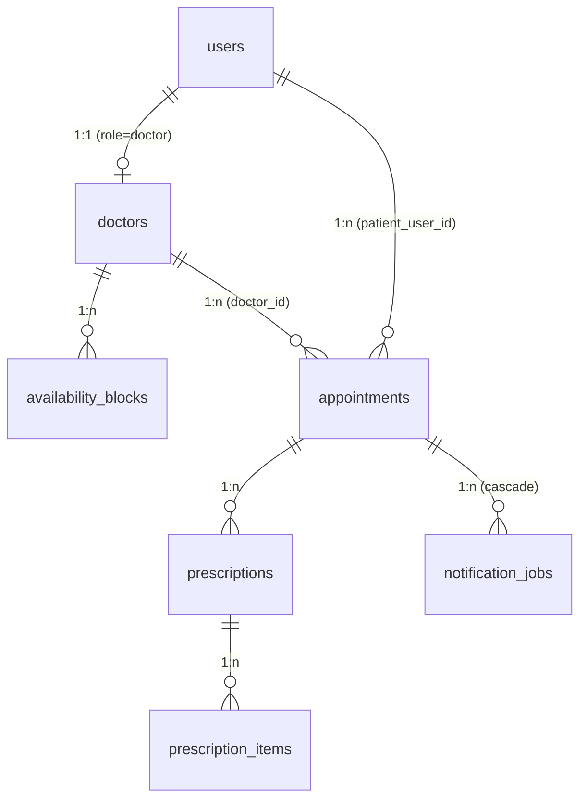

# 04 — Database Document

| Field            | Value                                                         |
| ---------------- | ------------------------------------------------------------- |
| Document ID      | 04-DATABASE_DOCUMENT                                          |
| Status           | Canonical                                                     |
| Version          | 1.10                                                          |
| Last updated     | 2026-06-28                                                    |
| Sources absorbed | `prisma/schema.prisma`; `docs/engineering/ARCHITECTURE.md §5` |
| Related docs     | 02, 03, 05, 08, 15                                            |

---

## Index

1. [Database type](#1-database-type)
2. [Core tables](#2-core-tables)
3. [Table relationships](#3-table-relationships)
4. [Indexing strategy](#4-indexing-strategy)
5. [Naming conventions](#5-naming-conventions)
6. [Scope-to-database notes](#6-scope-to-database-notes)
7. [Revision footer](#revision-footer)

---

## Purpose

This document is a faithful re-presentation of `prisma/schema.prisma` and `ARCHITECTURE.md §5`. It describes every table, field, enum, constraint, and index in the v1 database, maps them to feature scope, and records the rationale for the critical integrity invariants. It does not replace the schema file — the schema file remains the single source of truth.

---

## 1. Database type

**PostgreSQL via Prisma** (relational). The Prisma client is generated with `provider = "prisma-client-js"` and connected via the `DATABASE_URL` environment variable.

All timestamps are stored as `timestamptz` in **UTC**. The UI renders them in `Asia/Karachi` (UTC+5, no DST). Money is stored as **integer PKR paisa** (no floats) to avoid drift — e.g. a fee of Rs 500 is stored as `50000`. There is no v1 soft-delete pattern; records are either immutable by convention (prescriptions) or append-only (audit_log).

---

## 2. Core tables

### 2a. Enums

All enums are declared in `prisma/schema.prisma` and reproduced faithfully below.

```prisma
enum Role {
  patient
  doctor
  admin
}

enum DoctorStatus {
  pending
  active
}

/// Stored appointment states (manual-payment 3-state model, ADR-43). NOTE: `slot_available`
/// from PRD §4.3 is intentionally NOT a value here — availability is the ABSENCE of a row for
/// (doctor, slot). The first persisted state is `pending` (booking creates it on click and
/// locks the slot). Keeps the partial unique index small and makes slot-release a state
/// transition (→ `cancelled`) rather than a status flip.
enum AppointmentState {
  pending
  confirmed
  cancelled
}

enum AuditActorType {
  patient
  doctor
  admin
  system
}

enum NotificationType {
  booking_confirmation
  reminder_24h
  reminder_1h
  prescription_ready
  payment_submitted_admin
  payment_not_received
  cancellation
}

enum NotificationStatus {
  pending
  sent
  failed
  suppressed
}
```

**Key note on `AppointmentState`:** `slot_available` is intentionally absent. Availability is the _absence_ of a row for a `(doctor, slot)` pair. The first persisted state is `pending`, created on booking click (which also locks the slot and snapshots `feeAtBooking`). This design keeps the partial unique index (`uniq_active_slot`, over `pending`/`confirmed`) small. Slot release is the `→ cancelled` transition (admin reject, or patient/doctor/admin cancel), which removes the row from the index. The manual-payment pivot (ADR-43) collapsed the prior 10-state machine — `slot_locked`, `in_progress`, `completed`, `prescription_issued`, `cancelled_refunded`, `cancelled_no_refund`, `doctor_cancelled`, `patient_no_show`, `doctor_no_show` are all removed; the `PaymentStatus` and `RefundStatus` enums are dropped entirely with the `Payment` table and refund subsystem.

---

### 2b. User

All humans in the system — patients, doctors, and admins — share one table, discriminated by the `role` enum (ARCHITECTURE.md DA2).

```prisma
/// All humans: patients, doctors, admin. One table, discriminated by `role` (DA2).
model User {
  id                 String    @id @default(cuid())
  role               Role
  email              String    @unique
  passwordHash       String    @map("password_hash")
  phone              String?
  fullName           String    @map("full_name")
  /// Mandatory ToS/Privacy consent recorded at sign-up (P2, §3.6).
  tosAcceptedAt      DateTime? @map("tos_accepted_at") @db.Timestamptz(6)
  /// Forced first-login change gate for doctors (DA3/DA5).
  mustChangePassword Boolean   @default(false) @map("must_change_password")
  /// Password-reset (F01.03): SHA-256 hash of the single-use token (raw token only in the email link).
  resetTokenHash      String?   @map("reset_token_hash")
  /// Reset-token expiry (now + RESET_TOKEN_TTL_MIN); cleared with the hash on use/expiry.
  resetTokenExpiresAt DateTime? @map("reset_token_expires_at") @db.Timestamptz(6)
  createdAt          DateTime  @default(now()) @map("created_at") @db.Timestamptz(6)
  updatedAt          DateTime  @updatedAt @map("updated_at") @db.Timestamptz(6)

  doctor             Doctor?
  appointments       Appointment[] @relation("PatientAppointments")

  @@map("users")
}
```

---

### 2c. Doctor

Doctor profile; 1:1 with a `users` row of `role = doctor`. `pmcNumber` and the linked `User.email` are **immutable post-create** (invariant #8) — enforced by the service layer (no update DTO exposes these fields), not by a DB constraint.

```prisma
/// Doctor profile, 1:1 with a User of role=doctor.
/// IMMUTABILITY (PRD §3.3 #8): pmcNumber and the linked User.email must never be updated
/// post-create — enforced in doctor.service (no field in any update DTO), NOT by the DB.
model Doctor {
  id             String       @id @default(cuid())
  userId         String       @unique @map("user_id")
  user           User         @relation(fields: [userId], references: [id])
  pmcNumber      String       @unique @map("pmc_number")
  specialization String
  /// Consultation fee in PKR paisa. Snapshotted to Appointment.feeAtBooking at booking/lock (#6).
  fee            Int
  bio            String?
  photoUrl       String?      @map("photo_url")
  /// Gates public-listing visibility + new-booking eligibility ONLY — never login (#9).
  isActive       Boolean      @default(true) @map("is_active")
  status         DoctorStatus @default(pending)
  createdAt      DateTime     @default(now()) @map("created_at") @db.Timestamptz(6)
  updatedAt      DateTime     @updatedAt @map("updated_at") @db.Timestamptz(6)

  availabilityBlocks AvailabilityBlock[]
  appointments       Appointment[]

  @@map("doctors")
}
```

`isActive` controls public listing and new-booking eligibility only — a deactivated doctor can still log in and access their existing appointments (invariant #9).

`photoUrl`, when set, stores the path `/uploads/doctors/<doctorId>.<ext>` (ext: `jpg`, `png`, or `webp`); the file is served by the `express.static` `/uploads` mount with `X-Content-Type-Options: nosniff`.

---

### 2d. AvailabilityBlock

Recurring weekly availability windows (PRD D1). 30-minute slots are **generated at read time** from these blocks; individual slots are not stored as rows.

```prisma
/// Recurring weekly availability windows (D1). 30-min slots are GENERATED from these
/// at read time; individual slots are not stored.
model AvailabilityBlock {
  id        String @id @default(cuid())
  doctorId  String @map("doctor_id")
  doctor    Doctor @relation(fields: [doctorId], references: [id])
  /// 0=Sunday … 6=Saturday.
  weekday   Int
  /// "HH:mm", Asia/Karachi local time-of-day.
  startTime String @map("start_time")
  endTime   String @map("end_time")

  @@index([doctorId])
  @@map("availability_blocks")
}
```

`weekday` uses the JavaScript `Date.getDay()` convention: `0 = Sunday` through `6 = Saturday`. `startTime` and `endTime` are stored as `"HH:mm"` strings in Asia/Karachi local time.

---

### 2e. Appointment

The core booking record and the hub of the state machine (PRD §4.3). Doctor name is **never** stored here — historical doctor identity lives in `Prescription.doctorSnapshot` (invariant #3).

```prisma
/// The core record + state machine (PRD §4.3). Doctor name is NEVER denormalized here (#3);
/// historical identity is captured in Prescription.doctorSnapshot instead.
model Appointment {
  id            String           @id @default(cuid())
  doctorId      String           @map("doctor_id")
  doctor        Doctor           @relation(fields: [doctorId], references: [id])
  patientUserId String           @map("patient_user_id")
  patient       User             @relation("PatientAppointments", fields: [patientUserId], references: [id])
  slotStart     DateTime         @map("slot_start") @db.Timestamptz(6)
  slotEnd       DateTime         @map("slot_end") @db.Timestamptz(6)
  state         AppointmentState @default(pending)
  /// Fee snapshot captured at booking/lock time (#6, ADR-43) — needed for the payment
  /// instructions shown to the patient while `pending`.
  feeAtBooking  Int?             @map("fee_at_booking")
  /// Patient's offline bank-transfer reference (manual-payment, ADR-43); set by POST /:id/pay.
  paymentReference   String?     @map("payment_reference")
  /// When the patient submitted the reference; drives the admin review queue.
  paymentSubmittedAt DateTime?   @map("payment_submitted_at") @db.Timestamptz(6)
  /// "Who is this for?" (P8). When false, subject* describe the third party.
  forSelf         Boolean        @default(true) @map("for_self")
  subjectName     String?        @map("subject_name")
  subjectAge      Int?           @map("subject_age")
  subjectRelation String?        @map("subject_relation")
  createdAt     DateTime         @default(now()) @map("created_at") @db.Timestamptz(6)
  updatedAt     DateTime         @updatedAt @map("updated_at") @db.Timestamptz(6)

  prescriptions Prescription[]
  notificationJobs NotificationJob[]

  // The UNIQUE no-double-booking guarantee is the partial index added in the migration
  // (see file header). These are plain query indexes only.
  @@index([doctorId, slotStart])
  @@index([slotStart])
  @@index([patientUserId])
  @@index([state])
  @@map("appointments")
}
```

`feeAtBooking` is the snapshot of `Doctor.fee` taken at **booking/lock time** (when the `pending` row is created), so the payment instructions can show the amount due immediately (invariant #6; changed from "on confirm" by ADR-43). The `forSelf / subjectName / subjectAge / subjectRelation` fields implement the "booking for a third party" feature (PRD P8).

`paymentReference` and `paymentSubmittedAt` are the manual-payment fields (ADR-43; migration `20260627000000_manual_payment_pivot`): `POST /api/appointments/:id/pay` records the patient's offline bank-transfer reference and the submission time, leaves the state `pending`, and enqueues the admin review alert. The admin then accepts (→ `confirmed`) or rejects (→ `cancelled`). The pivot migration also dropped the former `disputed`, `lockExpiresAt`, `doctorJoinedAt`, and `patientJoinedAt` columns (no dispute flag, no lock-expiry, no participant-join tracking).

---

### 2f. Payment — removed (ADR-43)

The `Payment` model and the `payments` table were **dropped entirely** by the manual-payment pivot (ADR-43; migration `20260627000000_manual_payment_pivot` runs `DROP TABLE IF EXISTS "payments"`). There is no online gateway, no payment record, no `gatewayFee`/refund columns, and no payment-intent / refund idempotency keys. Offline bank-transfer payment is now captured by two columns on `Appointment` — `paymentReference` + `paymentSubmittedAt` (§2e) — and verified manually by the admin. The former `PaymentStatus` and `RefundStatus` enums are also dropped (§2a). The no-cascade release policy that this section documented (force-expire-the-lock-instead-of-delete) no longer applies: a slot frees by the `→ cancelled` transition, not by deleting an appointment.

---

### 2g. Prescription

Immutable once written (invariant #4). No update or delete service method or route exists for this model. A correction is a new prescription row linked to the same appointment.

```prisma
/// Immutable once written (#4). No update/delete service method or route exists; a correction
/// is a NEW prescription row linked to the same appointment.
model Prescription {
  id                String   @id @default(cuid())
  appointmentId     String   @map("appointment_id")
  appointment       Appointment @relation(fields: [appointmentId], references: [id])
  issuedAt          DateTime @default(now()) @map("issued_at") @db.Timestamptz(6)
  /// Durable doctor identity at issue-time (#3): name, pmcNumber, specialization.
  doctorSnapshot    Json     @map("doctor_snapshot")
  /// Durable patient/subject identity at issue-time (P8): for_self, name, age, relation.
  patientIdSnapshot Json     @map("patient_id_snapshot")
  notes             String?
  followUpDate      DateTime? @map("follow_up_date") @db.Date

  items PrescriptionItem[]

  @@index([appointmentId])
  @@map("prescriptions")
}
```

**`doctorSnapshot` shape (jsonb):** captures `name`, `pmcNumber`, and `specialization` at the moment of prescription issuance (invariant #3). (The `Doctor` model has no `signature` field in v1.) This is the mechanism by which a doctor's public profile can be updated without altering the historical record on a prescription.

**`patientIdSnapshot` shape (jsonb):** captures `forSelf`, `name`, `age`, and `relation` at the moment of issuance (PRD P8). Supports the "booking for a third party" scenario end-to-end on the printed prescription.

---

### 2h. PrescriptionItem

Line items with a price snapshot (invariant #5). Catalogue renames, repricing, or deactivation of a `Medicine` record do not alter what an existing prescription shows or totals.

```prisma
/// Line items with a PRICE SNAPSHOT (#5): catalogue renames/repricing/deactivation never
/// alter what an existing prescription shows or totals. Null price = free-text "not priced".
model PrescriptionItem {
  id             String       @id @default(cuid())
  prescriptionId String       @map("prescription_id")
  prescription   Prescription @relation(fields: [prescriptionId], references: [id])
  medicineName   String       @map("medicine_name")
  dosage         String
  duration       String
  instructions   String?
  /// PKR paisa, snapshotted. Null → displayed as "not priced", excluded from the total.
  price          Int?

  @@index([prescriptionId])
  @@map("prescription_items")
}
```

`medicineName` is a snapshotted string — not a FK to `medicines`. A `null` `price` is rendered as "not priced" and excluded from the running total.

---

### 2i. Medicine

Admin-managed medicine catalogue (PRD A2). The source of suggested prices that get snapshotted into `PrescriptionItem.price` at prescribe-time.

```prisma
/// Admin catalogue (A2). The source of suggested prices; snapshotted at prescribe-time.
model Medicine {
  id          String   @id @default(cuid())
  name        String
  genericName String?  @map("generic_name")
  dosageForms String[] @map("dosage_forms")
  /// Suggested unit price in PKR paisa.
  unitPrice   Int      @map("unit_price")
  isActive    Boolean  @default(true) @map("is_active")
  createdAt   DateTime @default(now()) @map("created_at") @db.Timestamptz(6)
  updatedAt   DateTime @updatedAt @map("updated_at") @db.Timestamptz(6)

  @@map("medicines")
}
```

`dosageForms` is a PostgreSQL text array. `isActive = false` removes the entry from the search autocomplete; it does not affect existing prescription items (which carry their own snapshot).

---

### 2j. AuditLog

Append-only event log (ARCHITECTURE.md §3.6). Written exclusively via `audit.service.record()`; no update or delete path is exposed at the service or route layer (convention, not a DB trigger).

```prisma
/// Append-only event log (§3.6). Written ONLY via audit.service.record(); no update/delete
/// path is exposed at the service or route layer (convention, not a DB trigger).
model AuditLog {
  id        String         @id @default(cuid())
  at        DateTime       @default(now()) @db.Timestamptz(6)
  eventType String         @map("event_type")
  actorType AuditActorType @map("actor_type")
  actorId   String?        @map("actor_id")
  targetRef String?        @map("target_ref")
  reason    String?
  meta      Json?

  @@index([eventType])
  @@index([actorType])
  @@index([at])
  @@index([targetRef])
  @@map("audit_log")
}
```

`actorId` is nullable to allow `actorType = system` entries (background workers). `targetRef` is a free-text reference to the affected record: a **bare id** — the `doctor.id` or `appointmentId` — or, for the unhandled-exception bridge in the error handler, the **route path** taken from `req.path` (e.g. `'/api/doctors/xyz'`). It is not a `"type:id"`-prefixed value. `meta` is an open jsonb field for event-specific payload (e.g. previous state, amounts).

---

### 2k. AnalyticsEvent

KPI telemetry table (PRD §1 KPI #1 / #3). `networkType` supports the 3G-success KPI.

```prisma
/// KPI telemetry (PRD §1 #1/#3). `networkType` supports the 3G-success KPI.
model AnalyticsEvent {
  id          String   @id @default(cuid())
  at          DateTime @default(now()) @db.Timestamptz(6)
  type        String
  networkType String?  @map("network_type")
  meta        Json?

  @@index([type])
  @@index([at])
  @@map("analytics_events")
}
```

---

### 2l. Settings

Single-row platform config (PRD A6). The application always reads and writes the row with `id = 1`. One-row enforcement is a service-layer convention, not a DB constraint.

```prisma
/// Single-row platform config (A6). Enforce one row in application code (always read/write id=1).
model Settings {
  id                    Int      @id @default(1)
  /// Floor 30 (PRD); default 60. Booking lead-time filter.
  minBookingLeadMinutes Int      @default(60) @map("min_booking_lead_minutes")
  /// Manual-payment bank-transfer instructions (ADR-43); shown to the patient as
  /// `paymentInstructions` for a pending appointment. All nullable (unconfigured = blank).
  bankName              String?  @map("bank_name")
  bankAccountName       String?  @map("bank_account_name")
  bankAccountNumber     String?  @map("bank_account_number")
  bankInstructions      String?  @map("bank_instructions")
  updatedAt             DateTime @updatedAt @map("updated_at") @db.Timestamptz(6)

  @@map("settings")
}
```

`bankName`, `bankAccountName`, `bankAccountNumber`, and `bankInstructions` are the admin-editable bank-transfer details (ADR-43; migration `20260627000000_manual_payment_pivot`). The appointment-detail endpoint returns them (with the amount due) as `paymentInstructions` for an owned `pending` appointment. The former `fallbackFeePctBps` / `fallbackFeeFixed` fallback-fee fields were dropped with the refund subsystem.

---

### 2m. Session

Server session store managed by `connect-pg-simple`. Prisma owns this DDL via migrations; `connect-pg-simple` is configured with `createTableIfMissing: false` so the two do not race on table creation.

```prisma
/// Server sessions for connect-pg-simple. The store's default table shape.
/// NOTE: configure connect-pg-simple with `createTableIfMissing: false` so Prisma migrations
/// own this DDL and the two don't race on table creation.
model Session {
  sid    String   @id
  sess   Json
  expire DateTime @db.Timestamptz(6)

  @@index([expire], map: "IDX_session_expire")
  @@map("session")
}
```

`expire` is indexed (`IDX_session_expire`) so the session store's cleanup sweep is efficient.

---

### 2n. NotificationJob (Slice E)

Transactional email outbox (F07). The intent-to-send persists in the same database — and, for event emails, the same `$transaction` — as the state change that promised it, so a crash between commit and send can never lose an email. The minute-cron dispatch worker delivers due rows, retries with exponential backoff, and suppresses reminders the appointment has invalidated (F07.03).

```prisma
/// Transactional email outbox (F07): the intent-to-send persists in the same DB (and, for
/// event emails, the same $transaction) as the state change that promised it. The dispatch
/// worker delivers, retries with backoff, and suppresses invalidated reminders.
model NotificationJob {
  id             String             @id @default(cuid())
  type           NotificationType
  appointmentId  String             @map("appointment_id")
  appointment    Appointment        @relation(fields: [appointmentId], references: [id], onDelete: Cascade)
  /// Snapshot at enqueue time.
  recipientEmail String             @map("recipient_email")
  /// Merge-vars snapshot at enqueue time (doc 14 §5 contract).
  vars           Json?
  scheduledFor   DateTime           @map("scheduled_for") @db.Timestamptz(6)
  /// Distinguishes repeatable sends of the same type for one appointment (Slice F:
  /// one prescription_ready per prescription). '' for singleton types (Slice E semantics).
  dedupeKey      String             @default("") @map("dedupe_key")
  status         NotificationStatus @default(pending)
  attempts       Int                @default(0)
  nextAttemptAt  DateTime?          @map("next_attempt_at") @db.Timestamptz(6)
  lastError      String?            @map("last_error")
  sentAt         DateTime?          @map("sent_at") @db.Timestamptz(6)
  createdAt      DateTime           @default(now()) @map("created_at") @db.Timestamptz(6)
  updatedAt      DateTime           @updatedAt @map("updated_at") @db.Timestamptz(6)

  /// Idempotent enqueue: a replay cannot duplicate a job. dedupeKey='' keeps Slice E
  /// types singleton-per-appointment; prescription_ready uses the prescription id.
  @@unique([appointmentId, type, dedupeKey])
  @@index([status, scheduledFor])
  @@map("notification_jobs")
}
```

`recipientEmail` and `vars` are snapshots taken at enqueue time (doc 14 §5 merge-var contract) — no PHI beyond what `appointments`/`users` already hold. The `@@unique([appointmentId, type, dedupeKey])` makes enqueue idempotent (a replayed enqueue is a no-op upsert). `dedupeKey` defaults to `''`, preserving the Slice E singleton-per-`(appointment, type)` semantics; Slice F (migration `20260612003907_slice_f_outbox_dedupe_key`) widened the constraint to a 3-column composite so `prescription_ready` can set `dedupeKey` to the prescription id and thus enqueue one email per prescription (including corrections). The `onDelete: Cascade` is retained so that if an appointment is ever deleted its outbox jobs do not block the delete; in the manual-payment model (ADR-43) appointments are not deleted to free a slot — a slot frees via the `→ cancelled` transition. The `@@index([status, scheduledFor])` feeds the dispatch worker's due-rows query.

---

### Deferred — Medicine Ordering tables (NOT in v1 build)

The Medicine Ordering module described in PRD §6 (orders / order_items) is **not yet modeled** in `prisma/schema.prisma`. It is deferred to a post-v1 milestone and will reuse the payment adapter, audit log, and snapshot discipline when added.

---

## 3. Table relationships



**FK links:**

| Child table           | FK column         | Parent table    | Notes                                                  |
| --------------------- | ----------------- | --------------- | ------------------------------------------------------ |
| `doctors`             | `user_id`         | `users`         | `@unique` — enforces 1:1                               |
| `availability_blocks` | `doctor_id`       | `doctors`       | Many blocks per doctor                                 |
| `appointments`        | `doctor_id`       | `doctors`       | Many appointments per doctor                           |
| `appointments`        | `patient_user_id` | `users`         | Named relation `PatientAppointments`                   |
| `prescriptions`       | `appointment_id`  | `appointments`  | 1..n per appointment (immutable; correction = new row) |
| `prescription_items`  | `prescription_id` | `prescriptions` | Many items per prescription                            |
| `notification_jobs`   | `appointment_id`  | `appointments`  | Outbox rows; `onDelete: Cascade` (a deleted appointment drops its jobs) |

**Why doctor name is not on `appointments` (invariant #3):** The `appointments` table stores only `doctor_id` (a FK), never the doctor's name, specialization, or fee. If a doctor's display name were stored directly on the appointment and the doctor's profile were later updated, historical records would either change (incorrect) or diverge (inconsistent). Historical doctor identity is instead captured at the moment of prescription issuance in `Prescription.doctorSnapshot` (a jsonb snapshot of name, pmcNumber, specialization). The appointment row itself is only the booking record; the prescription is the legal document that needs the durable identity.

**Prescription / appointment 1..n relation (invariant #4):** A single appointment may have multiple prescription rows. This is intentional: prescriptions are immutable once written, so a correction cannot update an existing row — instead the doctor submits a new prescription linked to the same appointment. The patient always sees the chronological list; the most-recent row supersedes earlier ones for display.

---

## 4. Indexing strategy

### 4a. Declared unique constraints (from schema)

| Table      | Constraint                      | Columns                         | Invariant                       |
| ---------- | ------------------------------- | ------------------------------- | ------------------------------- |
| `users`    | `@@unique`                      | `email`                         | Email uniqueness (DA2)          |
| `doctors`  | `@@unique`                      | `user_id`                       | 1:1 user↔doctor                 |
| `doctors`  | `@@unique`                      | `pmc_number`                    | PMC number uniqueness           |
| `notification_jobs` | `@@unique`            | `(appointment_id, type, dedupe_key)` | Idempotent enqueue (replay-safe outbox, F07); `dedupe_key=''` = singleton per type, prescription id = per-prescription (Slice F) |

### 4b. The no-double-booking partial unique index (invariant #1)

This index is the most critical integrity constraint in the system. **Prisma's DSL cannot express a partial (`WHERE`) index**, so it is not declared in `schema.prisma`. Instead, after running `prisma migrate dev`, the generated `migration.sql` is hand-edited to append:

```sql
CREATE UNIQUE INDEX uniq_active_slot ON appointments (doctor_id, slot_start)
  WHERE state IN ('pending', 'confirmed');
```

**Active states covered:** `pending`, `confirmed` (the two non-terminal states in the 3-state model, ADR-43; migration `20260628000000_drop_completed_state` rebuilt the index with this list). **Releasing / terminal state excluded:** `cancelled`. When an appointment is cancelled, its `(doctor_id, slot_start)` pair is no longer covered by the index, so the slot becomes rebookable. A second insert for a currently-held slot fails at write time (a unique violation), not at application-level validation time — this is intentional.

**Migration caveat:** This index must be re-applied whenever the `appointments` table is recreated via a destructive migration. See the `prisma/schema.prisma` header (this §4b is the canonical caveat).

### 4c. Query indexes (non-unique)

| Table                 | Index                                 | Columns                   | Purpose                                                               |
| --------------------- | ------------------------------------- | ------------------------- | --------------------------------------------------------------------- |
| `availability_blocks` | `@@index`                             | `doctor_id`               | Slot-generation query for a given doctor                              |
| `appointments`        | `@@index`                             | `(doctor_id, slot_start)` | Slot lookup; feeds availability/booking screen filters                |
| `appointments`        | `@@index`                             | `slot_start`              | Admin records time-range (`from`/`to`) queries (F13); migration `20260613213051_slice_h_s6_indexes` |
| `appointments`        | `@@index`                             | `patient_user_id`         | Patient appointment history screen (P-06)                             |
| `appointments`        | `@@index`                             | `state`                   | State-filtered queries (admin review queue `state=pending`, etc.)     |
| `prescriptions`       | `@@index`                             | `appointment_id`          | Prescription list per appointment                                     |
| `prescription_items`  | `@@index`                             | `prescription_id`         | Item list per prescription                                            |
| `notification_jobs`   | `@@index`                             | `(status, scheduled_for)` | Dispatch worker's due-rows query (F07)                                |
| `audit_log`           | `@@index`                             | `event_type`              | Admin audit search filter (A5)                                        |
| `audit_log`           | `@@index`                             | `actor_type`              | Admin audit search filter (A5)                                        |
| `audit_log`           | `@@index`                             | `at`                      | Time-range queries on audit log (A5)                                  |
| `audit_log`           | `@@index`                             | `target_ref`              | Admin audit search filters on `target_ref` (F13); migration `20260613213051_slice_h_s6_indexes` |
| `analytics_events`    | `@@index`                             | `type`                    | KPI aggregation by event type                                         |
| `analytics_events`    | `@@index`                             | `at`                      | Time-range KPI queries                                                |
| `session`             | `@@index` (map: `IDX_session_expire`) | `expire`                  | Session store cleanup sweep                                           |

### 4d. Admin search/time-range indexes (applied)

These indexes were **recommended by the Slice G admin-panel review** to back admin search/time-range queries and were **applied in Slice H · S6** via migration `20260613213051_slice_h_s6_indexes`. They are now live in `prisma/schema.prisma` and included in the §4c inventory above.

| Table          | Index                    | Backs                                                       |
| -------------- | ------------------------ | ----------------------------------------------------------- |
| `audit_log`    | `@@index([targetRef])`   | Admin audit search filters on `targetRef` (F13)             |
| `appointments` | `@@index([slotStart])`   | Admin records time-range (`from`/`to`) queries (F13)        |

---

## 5. Naming conventions

| Convention                   | Rule                                                                                                                    | Example                                                     |
| ---------------------------- | ----------------------------------------------------------------------------------------------------------------------- | ----------------------------------------------------------- |
| Table names                  | `snake_case` via `@@map(...)`                                                                                           | `availability_blocks`, `audit_log`                          |
| Model names                  | PascalCase (Prisma DSL)                                                                                                 | `AvailabilityBlock`, `AuditLog`                             |
| Column names                 | `snake_case` via `@map(...)`                                                                                            | `patient_user_id`, `fee_at_booking`                         |
| Field names                  | `camelCase` (Prisma DSL)                                                                                                | `patientUserId`, `feeAtBooking`                             |
| ID fields                    | `id` on every model; type `String @id @default(cuid())` except `Settings.id Int @id @default(1)`                        | `id String @id @default(cuid())`                            |
| Timestamp columns            | `created_at` (`@default(now())`), `updated_at` (`@updatedAt`); both `@db.Timestamptz(6)` UTC                            | `created_at`, `updated_at`                                  |
| Status enums                 | lowercase values, underscore-separated where multi-word                                                                 | `pending`, `confirmed`, `payment_submitted_admin`           |
| Boolean flags                | `is_` prefix for state toggles; direct name for workflow markers                                                        | `is_active`, `must_change_password`, `for_self`             |
| Money fields                 | Integer PKR paisa                                                                                                       | `fee`, `amount`, `unit_price`, `fee_at_booking`             |
| Append-only / no-soft-delete | `audit_log` and `prescriptions` are append-only by service-layer convention; no `deleted_at` column exists on any table | —                                                           |

---

## 6. Scope-to-database notes

The feature IDs below are the canonical IDs defined in `docs/specification/02-SCOPE_FEATURE_DOCUMENT.md`.

| Feature                                              | Primary tables                                     | Notes                                                                                                                                           |
| ---------------------------------------------------- | -------------------------------------------------- | ----------------------------------------------------------------------------------------------------------------------------------------------- |
| F01 — Patient authentication & account               | `users`, `session`                                 | Sign-up/login/reset; `tos_accepted_at` consent; `must_change_password`; reset via `reset_token_hash` + `reset_token_expires_at`; sessions stored in `session`                                            |
| F02 — Doctor discovery (listing & profile)           | `doctors`, `users`, `availability_blocks`          | `is_active` + `status = active` gate the public listing; blocks feed the next-available slot                                                    |
| F03 — Slot booking & slot-lock                       | `appointments`, `availability_blocks`              | Slots generated at read time; booking creates `pending` (locks the slot, snapshots `fee_at_booking`); partial unique index prevents double-book |
| F04 — Manual payment & admin review                  | `appointments`, `settings`                         | Offline bank transfer (ADR-43); patient submits `payment_reference`/`payment_submitted_at`; admin accept (`→confirmed`) / reject (`→cancelled`); bank details on `settings`. No `payments` table, no gateway/refund |
| F05 — Appointment lifecycle & video                  | `appointments`                                     | State machine hub (3 states); Daily room/token lifecycle managed by the adapter against `appointment.id` (free tier — no webhook, no join columns, no dedicated table) |
| F06 — Cancellation                                   | `appointments`                                     | `→ cancelled` from `pending` or `confirmed` (patient/doctor/admin); frees the slot. No refund — money handled offline (ADR-43)                  |
| F07 — Reminders & notifications                      | `notification_jobs`, `appointments` (read)         | Transactional outbox (Slice E); event emails enqueue in the caller's `$transaction`; the dispatch worker re-checks appointment state before sending (F07.03), retries with backoff, and suppresses invalidated reminders |
| F08 — Prescription                                   | `prescriptions`, `prescription_items`, `medicines` | Immutable rows (#4); price snapshot (#5); `doctor_snapshot` / `patient_id_snapshot` jsonb (#3, P8)                                              |
| F09 — Doctor weekly availability                     | `availability_blocks`                              | Recurring weekly windows; 30-min slots generated at read time                                                                                   |
| F10 — Admin: doctor onboarding, edit, (de)activation | `doctors`, `users`                                 | Admin CRUD; `pmc_number` + email immutability (#8); `is_active` / `status`                                                                      |
| F11 — Admin: medicine catalogue                      | `medicines`                                        | Admin CRUD; `is_active`; `unit_price` snapshotted to `prescription_items.price`                                                                 |
| F12 — Admin: system-health alerts                    | `audit_log`, `appointments` (read)                 | Derived from existing records; no dedicated alerts table in v1                                                                                  |
| F13 — Admin: records & audit log (unified)           | `audit_log`, `appointments`                        | Unified read-only search over records + the append-only audit log                                                                               |
| F14 — Admin: platform settings                       | `settings`                                         | Single row (`id = 1`); `min_booking_lead_minutes`; bank-transfer details (`bank_name`, `bank_account_name`, `bank_account_number`, `bank_instructions`) |
| F15 — Doctor & admin authentication & roles          | `users`, `session`                                 | `role` discriminator; `must_change_password`; role middleware reads the session                                                                 |
| F16 — Legal content (ToS / Privacy)                  | — (no table)                                       | Static `/legal/*` pages; acceptance timestamp recorded on `users.tos_accepted_at` (see F01)                                                     |

**KPI instrumentation (PRD §1 #1/#3):** the `analytics_events` table (`type`, `network_type`, `meta`) backs the KPI funnel and 3G video-join telemetry. This is platform telemetry, not a numbered v1 feature in doc 02; it supports the KPI table in doc 01.

**Medicine Ordering (PRD §6):** `orders` and `order_items` tables are **not yet modeled** in `prisma/schema.prisma` and are deferred to a post-v1 milestone.

---

## Revision footer

| Date       | Change           | Why                                                                       |
| ---------- | ---------------- | ------------------------------------------------------------------------- |
| 2026-06-01 | Initial creation | Faithful re-presentation of `prisma/schema.prisma` + `ARCHITECTURE.md §5` |
| 2026-06-03 | Added `reset_token_hash` + `reset_token_expires_at` to `users` (§2b, §6 F01) | Slice A password-reset storage (F01.03); schema change per change-impact matrix |
| 2026-06-05 | Added `doctor_joined_at` + `patient_joined_at` nullable TIMESTAMPTZ columns to `appointments` (§2e); migration `20260604141222_add_video_join_columns` | Slice D (F05 video & lifecycle) |
| 2026-06-11 | Dropped the deprecated `CONFIG.md §7` pointer from the §4b migration caveat (this section is the canonical home) | Deprecated-doc hygiene (design §8.1) |
| 2026-06-11 | Added `NotificationType`/`NotificationStatus` enums (§2a), `NotificationJob` model (§2n), `Appointment.notificationJobs` relation (§2e), `Payment.refund_attempts`/`next_refund_retry_at` (§2f), relationship + index + F07 scope entries; migration `20260610231617_slice_e_notification_outbox` | Slice E (F07 outbox + F06.03 refund-retry); schema change per change-impact matrix |
| 2026-06-12 | Added `NotificationJob.dedupe_key` (default `''`) and widened the `@@unique` to `(appointment_id, type, dedupe_key)` (§2n, §4a); migration `20260612003907_slice_f_outbox_dedupe_key`; aligned `doctorSnapshot` shape to drop the non-existent `signature` field (§2g, §3) | Slice F (F08 prescriptions): per-prescription `prescription_ready` enqueue; doctor model has no signature in v1 |
| 2026-06-13 | Corrected `AuditLog.targetRef` example to bare id / route-path (not `type:id`) (§2j); documented `Doctor.photoUrl` `/uploads/doctors/<id>.<ext>` static-serve format (§2c); added §4d deferred-index note (`audit_log.targetRef`, `appointments.slotStart`) | Slice G as-built sweep |
| 2026-06-13 | Added `manual_required` to the `RefundStatus` enum (§2a) + a `Payment` prose note on the PayFast-PK manual-refund degradation (§2f); migration `20260613181905_slice_h_refund_manual_required` | Slice H · S1 (PayFast Pakistan adapter; ADR-32) |
| 2026-06-14 | Applied the two deferred admin indexes — `appointments.slotStart` + `audit_log.targetRef` — to the embedded schema (§2e, §2j), §4c inventory, and §4d (now "applied", no longer deferred); migration `20260613213051_slice_h_s6_indexes` | Slice H · S6 (launch foundation + hardening) |
| 2026-06-14 | Documented the no-cascade release policy (§2f): `Payment.appointment` / `Prescription.appointment` are `ON DELETE RESTRICT` (no schema change) and the failed/abandoned-payment paths force-expire the lock rather than delete (ADR-39); corrected the now-stale §2n `onDelete: Cascade` rationale (the `payment.failed`/edge-#6a paths no longer delete — the cascade now backstops the lazy-reclaim delete) | Slice H · S7 (E2E QA + launch gate; ADR-39) |
| 2026-06-28 | Manual-payment pivot (ADR-43): `AppointmentState` → 3 values (`pending`/`confirmed`/`cancelled`); dropped `PaymentStatus`/`RefundStatus` enums and the `Payment` model (§2f); `NotificationType` → `payment_submitted_admin`/`payment_not_received`/`cancellation` (was refund/apology types); added `Appointment.paymentReference`/`paymentSubmittedAt`, dropped `disputed`/`lockExpiresAt`/`doctorJoinedAt`/`patientJoinedAt`, `feeAtBooking` now snapshot at booking; `Settings` gained the four bank fields, dropped `fallbackFee*`; `uniq_active_slot` now `WHERE state IN ('pending','confirmed')`; pruned payment FKs/indexes/scope rows; migrations `20260627000000_manual_payment_pivot` + `20260628000000_drop_completed_state` | Manual-payment pivot — schema as-built sync |
