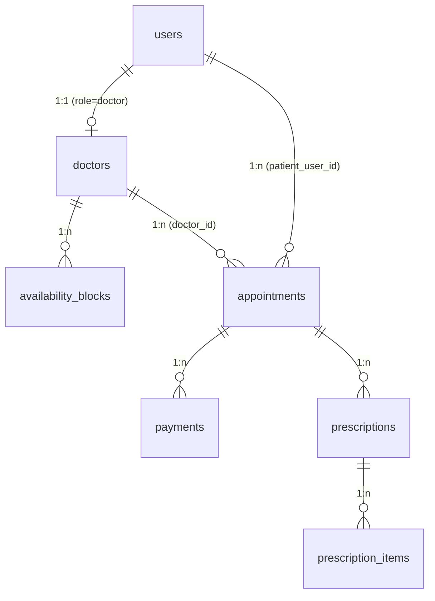

# 04 — Database Document

| Field | Value |
|---|---|
| Document ID | 04-DATABASE_DOCUMENT |
| Status | Canonical |
| Version | 1.0 |
| Last updated | 2026-06-01 |
| Sources absorbed | `prisma/schema.prisma`; `docs/engineering/ARCHITECTURE.md §5` |
| Related docs | 02, 03, 05, 08, 15 |

---

## Index

1. [Database type](#1-database-type)
2. [Core tables](#2-core-tables)
3. [Table relationships](#3-table-relationships)
4. [Indexing strategy](#4-indexing-strategy)
5. [Naming conventions](#5-naming-conventions)
6. [Scope-to-database notes](#6-scope-to-database-notes)
7. [Revision footer](#revision-footer)

---

## Purpose

This document is a faithful re-presentation of `prisma/schema.prisma` and `ARCHITECTURE.md §5`. It describes every table, field, enum, constraint, and index in the v1 database, maps them to feature scope, and records the rationale for the critical integrity invariants. It does not replace the schema file — the schema file remains the single source of truth.

---

## 1. Database type

**PostgreSQL via Prisma** (relational). The Prisma client is generated with `provider = "prisma-client-js"` and connected via the `DATABASE_URL` environment variable.

All timestamps are stored as `timestamptz` in **UTC**. The UI renders them in `Asia/Karachi` (UTC+5, no DST). Money is stored as **integer PKR paisa** (no floats) to avoid drift — e.g. a fee of Rs 500 is stored as `50000`. There is no v1 soft-delete pattern; records are either immutable by convention (prescriptions) or append-only (audit_log).

---

## 2. Core tables

### 2a. Enums

All enums are declared in `prisma/schema.prisma` and reproduced faithfully below.

```prisma
enum Role {
  patient
  doctor
  admin
}

enum DoctorStatus {
  pending
  active
}

/// Stored appointment states. NOTE: `slot_available` from PRD §4.3 is intentionally
/// NOT a value here — availability is the ABSENCE of a row for (doctor, slot). The first
/// persisted state is `slot_locked`. Keeps the partial unique index small and makes
/// lock-release a state transition / row-removal rather than a status flip.
enum AppointmentState {
  slot_locked
  confirmed
  in_progress
  completed
  prescription_issued
  cancelled_refunded
  cancelled_no_refund
  doctor_cancelled
  patient_no_show
  doctor_no_show
}

enum PaymentStatus {
  pending
  success
  failed
}

enum RefundStatus {
  initiated
  retrying
  settled
  failed
}

enum AuditActorType {
  patient
  doctor
  admin
  system
}
```

**Key note on `AppointmentState`:** `slot_available` is intentionally absent. Availability is the *absence* of a row for a `(doctor, slot)` pair. The first persisted state is `slot_locked`. This design keeps the partial unique index (`uniq_active_slot`) small and makes slot release a row-removal rather than a status flip.

---

### 2b. User

All humans in the system — patients, doctors, and admins — share one table, discriminated by the `role` enum (ARCHITECTURE.md DA2).

```prisma
/// All humans: patients, doctors, admin. One table, discriminated by `role` (DA2).
model User {
  id                 String    @id @default(cuid())
  role               Role
  email              String    @unique
  passwordHash       String    @map("password_hash")
  phone              String?
  fullName           String    @map("full_name")
  /// Mandatory ToS/Privacy consent recorded at sign-up (P2, §3.6).
  tosAcceptedAt      DateTime? @map("tos_accepted_at") @db.Timestamptz(6)
  /// Forced first-login change gate for doctors (DA3/DA5).
  mustChangePassword Boolean   @default(false) @map("must_change_password")
  createdAt          DateTime  @default(now()) @map("created_at") @db.Timestamptz(6)
  updatedAt          DateTime  @updatedAt @map("updated_at") @db.Timestamptz(6)

  doctor             Doctor?
  appointments       Appointment[] @relation("PatientAppointments")

  @@map("users")
}
```

---

### 2c. Doctor

Doctor profile; 1:1 with a `users` row of `role = doctor`. `pmcNumber` and the linked `User.email` are **immutable post-create** (invariant #8) — enforced by the service layer (no update DTO exposes these fields), not by a DB constraint.

```prisma
/// Doctor profile, 1:1 with a User of role=doctor.
/// IMMUTABILITY (PRD §3.3 #8): pmcNumber and the linked User.email must never be updated
/// post-create — enforced in doctor.service (no field in any update DTO), NOT by the DB.
model Doctor {
  id             String       @id @default(cuid())
  userId         String       @unique @map("user_id")
  user           User         @relation(fields: [userId], references: [id])
  pmcNumber      String       @unique @map("pmc_number")
  specialization String
  /// Consultation fee in PKR paisa. Snapshotted to Appointment.feeAtBooking at confirm (#6).
  fee            Int
  bio            String?
  photoUrl       String?      @map("photo_url")
  /// Gates public-listing visibility + new-booking eligibility ONLY — never login (#9).
  isActive       Boolean      @default(true) @map("is_active")
  status         DoctorStatus @default(pending)
  createdAt      DateTime     @default(now()) @map("created_at") @db.Timestamptz(6)
  updatedAt      DateTime     @updatedAt @map("updated_at") @db.Timestamptz(6)

  availabilityBlocks AvailabilityBlock[]
  appointments       Appointment[]

  @@map("doctors")
}
```

`isActive` controls public listing and new-booking eligibility only — a deactivated doctor can still log in and access their existing appointments (invariant #9).

---

### 2d. AvailabilityBlock

Recurring weekly availability windows (PRD D1). 30-minute slots are **generated at read time** from these blocks; individual slots are not stored as rows.

```prisma
/// Recurring weekly availability windows (D1). 30-min slots are GENERATED from these
/// at read time; individual slots are not stored.
model AvailabilityBlock {
  id        String @id @default(cuid())
  doctorId  String @map("doctor_id")
  doctor    Doctor @relation(fields: [doctorId], references: [id])
  /// 0=Sunday … 6=Saturday.
  weekday   Int
  /// "HH:mm", Asia/Karachi local time-of-day.
  startTime String @map("start_time")
  endTime   String @map("end_time")

  @@index([doctorId])
  @@map("availability_blocks")
}
```

`weekday` uses the JavaScript `Date.getDay()` convention: `0 = Sunday` through `6 = Saturday`. `startTime` and `endTime` are stored as `"HH:mm"` strings in Asia/Karachi local time.

---

### 2e. Appointment

The core booking record and the hub of the state machine (PRD §4.3). Doctor name is **never** stored here — historical doctor identity lives in `Prescription.doctorSnapshot` (invariant #3).

```prisma
/// The core record + state machine (PRD §4.3). Doctor name is NEVER denormalized here (#3);
/// historical identity is captured in Prescription.doctorSnapshot instead.
model Appointment {
  id            String           @id @default(cuid())
  doctorId      String           @map("doctor_id")
  doctor        Doctor           @relation(fields: [doctorId], references: [id])
  patientUserId String           @map("patient_user_id")
  patient       User             @relation("PatientAppointments", fields: [patientUserId], references: [id])
  slotStart     DateTime         @map("slot_start") @db.Timestamptz(6)
  slotEnd       DateTime         @map("slot_end") @db.Timestamptz(6)
  state         AppointmentState @default(slot_locked)
  /// Fee snapshot captured on transition to `confirmed` (#6). Null while slot_locked.
  feeAtBooking  Int?             @map("fee_at_booking")
  /// "Who is this for?" (P8). When false, subject* describe the third party.
  forSelf         Boolean        @default(true) @map("for_self")
  subjectName     String?        @map("subject_name")
  subjectAge      Int?           @map("subject_age")
  subjectRelation String?        @map("subject_relation")
  /// Support-workflow marker, orthogonal to the state machine (§3.6). Admin-set via A5.
  disputed      Boolean          @default(false)
  /// now()+10min while slot_locked; the lock-release worker reads this.
  lockExpiresAt DateTime?        @map("lock_expires_at") @db.Timestamptz(6)
  createdAt     DateTime         @default(now()) @map("created_at") @db.Timestamptz(6)
  updatedAt     DateTime         @updatedAt @map("updated_at") @db.Timestamptz(6)

  payments      Payment[]
  prescriptions Prescription[]

  // The UNIQUE no-double-booking guarantee is the partial index added in the migration
  // (see file header). These are plain query indexes only.
  @@index([doctorId, slotStart])
  @@index([patientUserId])
  @@index([state])
  @@map("appointments")
}
```

`feeAtBooking` is `null` while the appointment is `slot_locked` and is populated (snapshot from `Doctor.fee`) on transition to `confirmed` (invariant #6). The `forSelf / subjectName / subjectAge / subjectRelation` fields implement the "booking for a third party" feature (PRD P8). `disputed` is an orthogonal support flag, admin-set; it does not participate in the state machine.

---

### 2f. Payment

One row per booking attempt. All idempotency for payment intents and refunds lives here.

```prisma
/// One row per booking attempt. Idempotency lives here (#7, #10).
model Payment {
  id                   String        @id @default(cuid())
  appointmentId        String        @map("appointment_id")
  appointment          Appointment   @relation(fields: [appointmentId], references: [id])
  /// Denormalized for the intent-idempotency key below; FK-less by design (scalar only).
  patientUserId        String        @map("patient_user_id")
  slotStart            DateTime      @map("slot_start") @db.Timestamptz(6)
  providerRef          String?       @map("provider_ref")
  status               PaymentStatus @default(pending)
  /// Charged amount in PKR paisa.
  amount               Int
  /// Gateway-reported fee (paisa); drives refund math + cancellation estimate (policy #5).
  gatewayFee           Int?          @map("gateway_fee")
  refundIdempotencyKey String?       @unique @map("refund_idempotency_key")
  refundRef            String?       @map("refund_ref")
  refundStatus         RefundStatus? @map("refund_status")
  createdAt            DateTime      @default(now()) @map("created_at") @db.Timestamptz(6)
  updatedAt            DateTime      @updatedAt @map("updated_at") @db.Timestamptz(6)

  /// Payment-intent idempotency on (patient, slot) (#7): a retry/double-submit cannot
  /// open two parallel intents for the same booking attempt.
  @@unique([patientUserId, slotStart], name: "intent_key")
  @@index([appointmentId])
  @@map("payments")
}
```

`patientUserId` and `slotStart` are denormalized scalars (not a separate FK relation) specifically to form the `intent_key` composite unique. `gatewayFee` (paisa) drives refund math and cancellation fee estimates under policy #5. When the gateway does not report a fee, the Settings fallback model applies.

---

### 2g. Prescription

Immutable once written (invariant #4). No update or delete service method or route exists for this model. A correction is a new prescription row linked to the same appointment.

```prisma
/// Immutable once written (#4). No update/delete service method or route exists; a correction
/// is a NEW prescription row linked to the same appointment.
model Prescription {
  id                String   @id @default(cuid())
  appointmentId     String   @map("appointment_id")
  appointment       Appointment @relation(fields: [appointmentId], references: [id])
  issuedAt          DateTime @default(now()) @map("issued_at") @db.Timestamptz(6)
  /// Durable doctor identity at issue-time (#3): name, pmcNumber, specialization, signature.
  doctorSnapshot    Json     @map("doctor_snapshot")
  /// Durable patient/subject identity at issue-time (P8): for_self, name, age, relation.
  patientIdSnapshot Json     @map("patient_id_snapshot")
  notes             String?
  followUpDate      DateTime? @map("follow_up_date") @db.Date

  items PrescriptionItem[]

  @@index([appointmentId])
  @@map("prescriptions")
}
```

**`doctorSnapshot` shape (jsonb):** captures `name`, `pmcNumber`, `specialization`, and `signature` at the moment of prescription issuance (invariant #3). This is the mechanism by which a doctor's public profile can be updated without altering the historical record on a prescription.

**`patientIdSnapshot` shape (jsonb):** captures `forSelf`, `name`, `age`, and `relation` at the moment of issuance (PRD P8). Supports the "booking for a third party" scenario end-to-end on the printed prescription.

---

### 2h. PrescriptionItem

Line items with a price snapshot (invariant #5). Catalogue renames, repricing, or deactivation of a `Medicine` record do not alter what an existing prescription shows or totals.

```prisma
/// Line items with a PRICE SNAPSHOT (#5): catalogue renames/repricing/deactivation never
/// alter what an existing prescription shows or totals. Null price = free-text "not priced".
model PrescriptionItem {
  id             String       @id @default(cuid())
  prescriptionId String       @map("prescription_id")
  prescription   Prescription @relation(fields: [prescriptionId], references: [id])
  medicineName   String       @map("medicine_name")
  dosage         String
  duration       String
  instructions   String?
  /// PKR paisa, snapshotted. Null → displayed as "not priced", excluded from the total.
  price          Int?

  @@index([prescriptionId])
  @@map("prescription_items")
}
```

`medicineName` is a snapshotted string — not a FK to `medicines`. A `null` `price` is rendered as "not priced" and excluded from the running total.

---

### 2i. Medicine

Admin-managed medicine catalogue (PRD A2). The source of suggested prices that get snapshotted into `PrescriptionItem.price` at prescribe-time.

```prisma
/// Admin catalogue (A2). The source of suggested prices; snapshotted at prescribe-time.
model Medicine {
  id          String   @id @default(cuid())
  name        String
  genericName String?  @map("generic_name")
  dosageForms String[] @map("dosage_forms")
  /// Suggested unit price in PKR paisa.
  unitPrice   Int      @map("unit_price")
  isActive    Boolean  @default(true) @map("is_active")
  createdAt   DateTime @default(now()) @map("created_at") @db.Timestamptz(6)
  updatedAt   DateTime @updatedAt @map("updated_at") @db.Timestamptz(6)

  @@map("medicines")
}
```

`dosageForms` is a PostgreSQL text array. `isActive = false` removes the entry from the search autocomplete; it does not affect existing prescription items (which carry their own snapshot).

---

### 2j. AuditLog

Append-only event log (ARCHITECTURE.md §3.6). Written exclusively via `audit.service.record()`; no update or delete path is exposed at the service or route layer (convention, not a DB trigger).

```prisma
/// Append-only event log (§3.6). Written ONLY via audit.service.record(); no update/delete
/// path is exposed at the service or route layer (convention, not a DB trigger).
model AuditLog {
  id        String         @id @default(cuid())
  at        DateTime       @default(now()) @db.Timestamptz(6)
  eventType String         @map("event_type")
  actorType AuditActorType @map("actor_type")
  actorId   String?        @map("actor_id")
  targetRef String?        @map("target_ref")
  reason    String?
  meta      Json?

  @@index([eventType])
  @@index([actorType])
  @@index([at])
  @@map("audit_log")
}
```

`actorId` is nullable to allow `actorType = system` entries (background workers). `targetRef` is a free-text reference to the affected record (e.g. `"appointment:clx..."`). `meta` is an open jsonb field for event-specific payload (e.g. previous state, amounts).

---

### 2k. AnalyticsEvent

KPI telemetry table (PRD §1 KPI #1 / #3). `networkType` supports the 3G-success KPI.

```prisma
/// KPI telemetry (PRD §1 #1/#3). `networkType` supports the 3G-success KPI.
model AnalyticsEvent {
  id          String   @id @default(cuid())
  at          DateTime @default(now()) @db.Timestamptz(6)
  type        String
  networkType String?  @map("network_type")
  meta        Json?

  @@index([type])
  @@index([at])
  @@map("analytics_events")
}
```

---

### 2l. Settings

Single-row platform config (PRD A6). The application always reads and writes the row with `id = 1`. One-row enforcement is a service-layer convention, not a DB constraint.

```prisma
/// Single-row platform config (A6). Enforce one row in application code (always read/write id=1).
model Settings {
  id                    Int      @id @default(1)
  /// Floor 30 (PRD); default 60. Booking lead-time filter.
  minBookingLeadMinutes Int      @default(60) @map("min_booking_lead_minutes")
  /// Fallback gateway-fee model when PayFast reports no fee (policy #5).
  /// Percentage in basis points (e.g. 250 = 2.50%) + a fixed component in PKR paisa.
  fallbackFeePctBps     Int      @default(0) @map("fallback_fee_pct_bps")
  fallbackFeeFixed      Int      @default(0) @map("fallback_fee_fixed")
  updatedAt             DateTime @updatedAt @map("updated_at") @db.Timestamptz(6)

  @@map("settings")
}
```

`fallbackFeePctBps` is in basis points (250 = 2.50%). `fallbackFeeFixed` is a fixed PKR paisa component. These two fields implement the fallback fee model from policy #5 when PayFast does not report a gateway fee.

---

### 2m. Session

Server session store managed by `connect-pg-simple`. Prisma owns this DDL via migrations; `connect-pg-simple` is configured with `createTableIfMissing: false` so the two do not race on table creation.

```prisma
/// Server sessions for connect-pg-simple. The store's default table shape.
/// NOTE: configure connect-pg-simple with `createTableIfMissing: false` so Prisma migrations
/// own this DDL and the two don't race on table creation.
model Session {
  sid    String   @id
  sess   Json
  expire DateTime @db.Timestamptz(6)

  @@index([expire], map: "IDX_session_expire")
  @@map("session")
}
```

`expire` is indexed (`IDX_session_expire`) so the session store's cleanup sweep is efficient.

---

### Deferred — Medicine Ordering tables (NOT in v1 build)

The Medicine Ordering module described in PRD §6 (orders / order_items) is **not yet modeled** in `prisma/schema.prisma`. It is deferred to a post-v1 milestone and will reuse the payment adapter, audit log, and snapshot discipline when added.

---

## 3. Table relationships



**FK links:**

| Child table | FK column | Parent table | Notes |
|---|---|---|---|
| `doctors` | `user_id` | `users` | `@unique` — enforces 1:1 |
| `availability_blocks` | `doctor_id` | `doctors` | Many blocks per doctor |
| `appointments` | `doctor_id` | `doctors` | Many appointments per doctor |
| `appointments` | `patient_user_id` | `users` | Named relation `PatientAppointments` |
| `payments` | `appointment_id` | `appointments` | Many payments per appointment (retries) |
| `prescriptions` | `appointment_id` | `appointments` | 1..n per appointment (immutable; correction = new row) |
| `prescription_items` | `prescription_id` | `prescriptions` | Many items per prescription |

**Why doctor name is not on `appointments` (invariant #3):** The `appointments` table stores only `doctor_id` (a FK), never the doctor's name, specialization, or fee. If a doctor's display name were stored directly on the appointment and the doctor's profile were later updated, historical records would either change (incorrect) or diverge (inconsistent). Historical doctor identity is instead captured at the moment of prescription issuance in `Prescription.doctorSnapshot` (a jsonb snapshot of name, pmcNumber, specialization, signature). The appointment row itself is only the booking record; the prescription is the legal document that needs the durable identity.

**Prescription / appointment 1..n relation (invariant #4):** A single appointment may have multiple prescription rows. This is intentional: prescriptions are immutable once written, so a correction cannot update an existing row — instead the doctor submits a new prescription linked to the same appointment. The patient always sees the chronological list; the most-recent row supersedes earlier ones for display.

**Payment ↔ appointment:** Multiple payment rows per appointment are possible because a patient may retry after a failed payment attempt. Each attempt creates a new `payments` row. The `intent_key` unique on `(patient_user_id, slot_start)` (invariant #7) prevents two concurrent open intents for the same slot.

---

## 4. Indexing strategy

### 4a. Declared unique constraints (from schema)

| Table | Constraint | Columns | Invariant |
|---|---|---|---|
| `users` | `@@unique` | `email` | Email uniqueness (DA2) |
| `doctors` | `@@unique` | `user_id` | 1:1 user↔doctor |
| `doctors` | `@@unique` | `pmc_number` | PMC number uniqueness |
| `payments` | `@@unique` (name: `intent_key`) | `(patient_user_id, slot_start)` | Payment-intent idempotency (#7) |
| `payments` | `@unique` | `refund_idempotency_key` | Refund idempotency (#10) |

### 4b. The no-double-booking partial unique index (invariant #1)

This index is the most critical integrity constraint in the system. **Prisma's DSL cannot express a partial (`WHERE`) index**, so it is not declared in `schema.prisma`. Instead, after running `prisma migrate dev`, the generated `migration.sql` is hand-edited to append:

```sql
CREATE UNIQUE INDEX uniq_active_slot ON appointments (doctor_id, slot_start)
  WHERE state IN ('slot_locked','confirmed','in_progress','completed',
                  'prescription_issued','cancelled_no_refund');
```

**Releasing / terminal states excluded from the index:** `cancelled_refunded`, `doctor_cancelled`, `patient_no_show`, `doctor_no_show`. When an appointment reaches one of these states, its `(doctor_id, slot_start)` pair is no longer covered by the index, which means the slot becomes rebookable. A second insert for a currently-held slot fails at write time (a unique violation), not at application-level validation time — this is intentional.

**Migration caveat:** This index must be re-applied whenever the `appointments` table is recreated via a destructive migration. See `prisma/schema.prisma` header and `CONFIG.md §7`.

### 4c. Query indexes (non-unique)

| Table | Index | Columns | Purpose |
|---|---|---|---|
| `availability_blocks` | `@@index` | `doctor_id` | Slot-generation query for a given doctor |
| `appointments` | `@@index` | `(doctor_id, slot_start)` | Slot lookup; feeds availability/booking screen filters |
| `appointments` | `@@index` | `patient_user_id` | Patient appointment history screen (P-06) |
| `appointments` | `@@index` | `state` | Worker state-sweep queries (evaluation worker, reconciliation worker) |
| `payments` | `@@index` | `appointment_id` | Payment lookup per appointment |
| `prescriptions` | `@@index` | `appointment_id` | Prescription list per appointment |
| `prescription_items` | `@@index` | `prescription_id` | Item list per prescription |
| `audit_log` | `@@index` | `event_type` | Admin audit search filter (A5) |
| `audit_log` | `@@index` | `actor_type` | Admin audit search filter (A5) |
| `audit_log` | `@@index` | `at` | Time-range queries on audit log (A5) |
| `analytics_events` | `@@index` | `type` | KPI aggregation by event type |
| `analytics_events` | `@@index` | `at` | Time-range KPI queries |
| `session` | `@@index` (map: `IDX_session_expire`) | `expire` | Session store cleanup sweep |

---

## 5. Naming conventions

| Convention | Rule | Example |
|---|---|---|
| Table names | `snake_case` via `@@map(...)` | `availability_blocks`, `audit_log` |
| Model names | PascalCase (Prisma DSL) | `AvailabilityBlock`, `AuditLog` |
| Column names | `snake_case` via `@map(...)` | `patient_user_id`, `fee_at_booking` |
| Field names | `camelCase` (Prisma DSL) | `patientUserId`, `feeAtBooking` |
| ID fields | `id` on every model; type `String @id @default(cuid())` except `Settings.id Int @id @default(1)` | `id String @id @default(cuid())` |
| Timestamp columns | `created_at` (`@default(now())`), `updated_at` (`@updatedAt`); both `@db.Timestamptz(6)` UTC | `created_at`, `updated_at` |
| Status enums | lowercase values, underscore-separated | `slot_locked`, `cancelled_refunded` |
| Boolean flags | `is_` prefix for state toggles; direct name for workflow markers | `is_active`, `must_change_password`, `disputed`, `for_self` |
| Money fields | Integer PKR paisa | `fee`, `amount`, `unit_price`, `fee_at_booking` |
| Append-only / no-soft-delete | `audit_log` and `prescriptions` are append-only by service-layer convention; no `deleted_at` column exists on any table | — |

---

## 6. Scope-to-database notes

The feature IDs below are the canonical IDs defined in `docs/specification/02-SCOPE_FEATURE_DOCUMENT.md`.

| Feature | Primary tables | Notes |
|---|---|---|
| F01 — Patient authentication & account | `users`, `session` | Sign-up/login/reset; `tos_accepted_at` consent; `must_change_password`; sessions stored in `session` |
| F02 — Doctor discovery (listing & profile) | `doctors`, `users`, `availability_blocks` | `is_active` + `status = active` gate the public listing; blocks feed the next-available slot |
| F03 — Slot booking & slot-lock | `appointments`, `availability_blocks` | Slots generated at read time; `slot_locked` + `lock_expires_at`; partial unique index prevents double-lock |
| F04 — Payment | `payments`, `appointments` | Atomic confirm; `intent_key` unique (#7); `fee_at_booking` snapshot (#6); `gateway_fee`, `provider_ref` |
| F05 — Appointment lifecycle & video | `appointments` | State machine hub; video room/token lifecycle managed by the Daily adapter against `appointment.id` (no dedicated table) |
| F06 — Cancellation & refund | `appointments`, `payments` | Transitions to `cancelled_refunded` / `cancelled_no_refund` / `doctor_cancelled`; `refund_idempotency_key` (#10), `refund_ref`, `refund_status` |
| F07 — Reminders & notifications | `appointments` (read) | No dedicated table; the notification worker re-checks appointment state before dispatch |
| F08 — Prescription | `prescriptions`, `prescription_items`, `medicines` | Immutable rows (#4); price snapshot (#5); `doctor_snapshot` / `patient_id_snapshot` jsonb (#3, P8) |
| F09 — Doctor weekly availability | `availability_blocks` | Recurring weekly windows; 30-min slots generated at read time |
| F10 — Admin: doctor onboarding, edit, (de)activation | `doctors`, `users` | Admin CRUD; `pmc_number` + email immutability (#8); `is_active` / `status` |
| F11 — Admin: medicine catalogue | `medicines` | Admin CRUD; `is_active`; `unit_price` snapshotted to `prescription_items.price` |
| F12 — Admin: system-health alerts | `audit_log`, `payments`, `appointments` (read) | Derived from existing records; no dedicated alerts table in v1 |
| F13 — Admin: records & audit log (unified) | `audit_log`, `appointments`, `payments` | Unified read-only search over records + the append-only audit log |
| F14 — Admin: platform settings | `settings` | Single row (`id = 1`); `min_booking_lead_minutes`; fallback fee model |
| F15 — Doctor & admin authentication & roles | `users`, `session` | `role` discriminator; `must_change_password`; role middleware reads the session |
| F16 — Legal content (ToS / Privacy) | — (no table) | Static `/legal/*` pages; acceptance timestamp recorded on `users.tos_accepted_at` (see F01) |

**KPI instrumentation (PRD §1 #1/#3):** the `analytics_events` table (`type`, `network_type`, `meta`) backs the KPI funnel and 3G video-join telemetry. This is platform telemetry, not a numbered v1 feature in doc 02; it supports the KPI table in doc 01.

**Medicine Ordering (PRD §6):** `orders` and `order_items` tables are **not yet modeled** in `prisma/schema.prisma` and are deferred to a post-v1 milestone.

---

## Revision footer

| Date | Change | Why |
|---|---|---|
| 2026-06-01 | Initial creation | Faithful re-presentation of `prisma/schema.prisma` + `ARCHITECTURE.md §5` |
