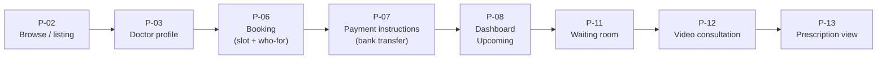
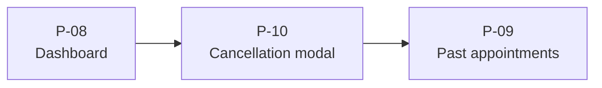
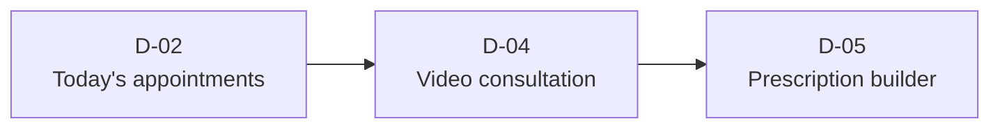

# 06 — Design System & Theme Document

| Field            | Value                                                                                     |
| ---------------- | ----------------------------------------------------------------------------------------- |
| Document ID      | `06-DESIGN_SYSTEM_THEME_DOCUMENT`                                                         |
| Status           | Canonical                                                                                 |
| Version          | 1.13                                                                                      |
| Last updated     | 2026-06-28                                                                                |
| Sources absorbed | `docs/design/DESIGN.md; mockups/assets/css/tokens.css; mockups/assets/css/components.css` |
| Related docs     | 02, 03                                                                                    |

---

## Index

1. [Screen flows](#1-screen-flows)
2. [Navigation structure](#2-navigation-structure)
3. [Key interactions](#3-key-interactions)
4. [Color palette](#4-color-palette)
5. [Typography](#5-typography)
6. [Spacing & layout](#6-spacing--layout)
7. [Component behavior](#7-component-behavior)

---

## Purpose

This document is the single-source canonical reference for the Dermestha visual design system and theme. It faithfully re-presents the design principles, screen inventory, tokens, and component conventions from `DESIGN.md`, `tokens.css`, and `components.css` so that any developer, designer, or agent can implement or audit the UI against one document. No facts are invented — every value is copied verbatim from the authoritative sources.

---

## 1. Screen flows

### Core interaction pattern

The dominant app flow is: **list → filter → select → confirm → state feedback**. This pattern governs booking, cancellation, prescription, and admin catalogue management.

### Patient booking flow

### Cancellation sub-flow

### Doctor consultation flow

### Reusable building blocks

- **Stepper** — linear progress indicator (Select slot → Who for → Pay) used in booking (P-06) and reset/onboarding flows.
- **Form section card** — white card with section title, grouped fields, and footer actions; backbone of booking, the prescription builder, and all admin forms.
- **Status badge** — squared (3 px), dot-less, semantic tint+text; appears in dashboards, listings, and admin tables.
- **Empty state** — centered icon + short message + primary CTA; used in P-08 ("No upcoming appointments — Browse doctors"), empty listing, and empty search.
- **Confirmation modal** — centered card on dimmed backdrop; used for cancellations (P-10), doctor cancel (D-06), admin deactivation (A-01).
- **Pagination** — shared page-envelope navigator (Previous / "Page X of Y" / Next, disabled at bounds) over the `{ number, size, total }` envelope; used under the A-04 records & audit tables. See §7.

---

## 2. Navigation structure

### Three surfaces

| Surface | Primary audience          | Nav chrome                                                       | Breakpoint behaviour                                      |
| ------- | ------------------------- | ---------------------------------------------------------------- | --------------------------------------------------------- |
| Patient | Patients (responsive web) | Top nav (desktop/logged-out) + bottom tab bar (mobile/logged-in) | Bottom tabs below 767 px → top nav at ≥ 768 px            |
| Doctor  | Doctors (desktop-first)   | Fixed left sidebar (240 px) + content header                     | Collapses to off-canvas drawer (hamburger) on mobile      |
| Admin   | Administrators (desktop)  | Fixed left sidebar (240 px)                                      | Collapses to drawer on mobile; tables scroll horizontally |

### Patient nav routes

| Route context       | Links                                                                       |
| ------------------- | --------------------------------------------------------------------------- |
| Public / logged-out | Browse, How it works, For doctors — Login (secondary button)                |
| Logged-in           | Browse / Appointments / Profile (bottom tabs on mobile; top nav on desktop) |

**Public SPA route map (Slice H · S4, ADR-35).** `/` serves the public **P-01 landing** (acquisition surface); the **doctor listing (P-02) is at `/browse`** (relocated from `/`). A patient with an active session hitting `/` is redirected to `/browse` (logged-out marketing page is never shown to a signed-in patient); doctors/admins are unaffected (role routing sends them to their own panels). These are client-side SPA routes (doc 05's REST inventory is unaffected).

### Doctor sidebar links

Appointments — Availability (weekly grid)

### Admin sidebar links

Doctors — Medicines — Payment review — Records & audit — System health — Settings

`/admin` redirects to `/admin/doctors` — the Doctors list is the admin landing page.

**Sidebar logout.** Both the doctor and admin sidebars render a **Log out** control at the foot of the sidebar (`POST /api/auth/logout` then a full reload to `/login`); it is the doctor/admin equivalent of the patient's Profile-hosted logout. The doctor sidebar's single `Appointments` link opens the D-02 page, whose in-page Today/History tabs (route links to `/doctor` and `/doctor/history`) toggle today vs past appointments — route-derived, so the active tab always matches the URL (ADR-42, mirrors the patient Upcoming/Past page).

### Screen-to-route inventory

| Screen ID | Screen name                              | Surface                  | PRD ref      |
| --------- | ---------------------------------------- | ------------------------ | ------------ |
| P-01      | Landing                                  | Patient (public)         | —            |
| P-02      | Doctor listing / Browse                  | Patient                  | P1           |
| P-03      | Doctor profile                           | Patient                  | P1           |
| P-04      | Sign up                                  | Patient                  | P2           |
| P-05      | Login + password recovery                | Patient / Doctor / Admin | P2, DA2      |
| P-06      | Booking (slot + who-for)                 | Patient                  | P3, P8       |
| P-07      | Payment instructions (bank transfer)     | Patient                  | P3, edge #6a |
| P-08      | Dashboard — Upcoming                     | Patient                  | P9           |
| P-09      | Dashboard — Past appointments            | Patient                  | P7           |
| P-10      | Cancellation modal                       | Patient                  | P6           |
| P-11      | Pre-call waiting room                    | Patient                  | P5           |
| P-12      | Video consultation                       | Patient                  | P5           |
| P-13      | Prescription view + PDF                  | Patient                  | P7, §3.5     |
| D-01      | Forced first-login password change       | Doctor                   | DA3          |
| D-02      | Today's appointments + History           | Doctor                   | D2           |
| D-03      | Weekly availability grid                 | Doctor                   | D1           |
| D-04      | Video consultation (doctor)              | Doctor                   | D3           |
| D-05      | Prescription builder                     | Doctor                   | D4           |
| D-06      | Cancel appointment modal                 | Doctor                   | D5           |
| A-01      | Doctors — list / add / edit / deactivate (incl. weekly-template editor + profile-photo upload) | Admin                    | A1, A4       |
| A-02      | Medicine catalogue                       | Admin                    | A2           |
| A-03      | Alert feed / system health               | Admin                    | A3           |
| A-04      | Records & Audit Log                      | Admin                    | A5           |
| A-05      | Settings                                 | Admin                    | A6           |
| A-06      | Payment review (manual-payment queue)    | Admin                    | A6, ADR-43   |

> **Note (canonical screen-ID registry).** The 25 rows above are the authoritative screen-ID registry — cite these IDs verbatim across the suite. The patient bottom-nav **Profile** destination (§2 navigation, below) is intentionally not a dedicated v1 screen: in v1 it routes to a minimal account view (logout + basic details); richer account management (account deletion / data-export → v1.1; family profiles → v1.2+) is deferred, so it carries no `P-NN` ID.

---

## 3. Key interactions

### Form validation

- **Text input** default border uses `border-strong`; on focus the border switches to spruce (`color-primary`) with a `0 0 0 3px rgba(15,58,42,.15)` ring.
- Error state: `color-danger` border, `color-danger-deep` helper text below the field.
- Label sits above the field in Archivo label-case 12 px (`.field > label`).
- Helper text and error text both use `fs-caption` (12 px); helper in `color-text-muted`, error in `color-danger-deep`.

### Landing (P-01)

P-01 is the public acquisition page served at `/` (Slice H · S4, **Built**). It carries its own brand topnav (Browse, "How it works", For doctors, Login) — the mockup's "How it works" call-to-action lives in the **topnav as an in-page anchor**, not as a hero button. The hero CTAs are **Browse** (`/browse`) and **Create your account / Sign up** (`/signup`). The "Featured specialists" grid uses **static placeholder data for v1** (no live query) and the cards are **display-only** — they are not links to a doctor profile (the real acquisition CTAs are the hero Browse / Sign-up buttons); the footer links to the legal pages (`/legal/terms`, `/legal/privacy`). The hero retains the single staggered reveal noted under Motion.

### Legal pages (F16)

`/legal/terms` and `/legal/privacy` are public/unauthenticated pages (Slice H · S4, **Built**) sharing one reusable **`LegalPage`** layout pattern: brand topnav, page title, a "last updated" line, a persistent **DRAFT banner**, and a list of structured `{ heading, body }` sections. They ship with explicit placeholder copy; final lawyer-reviewed copy replaces it behind the same template before launch (a pre-launch gate; ADR-35). Linked from the sign-up consent checkbox (below) and the P-01 footer.

### Mandatory consent checkbox (P-04)

Submit is blocked until the patient checks the ToS/Privacy consent checkbox. The checkbox uses spruce `accent-color`; the field copy includes inline links to `/legal/terms` and `/legal/privacy`.

### Slot selection (P-06)

As-built, the day-tabbed slot grid renders on the **doctor profile (P-03)**: a row of upcoming-day tabs (next 7 Karachi days) lets the patient pick a future day, and selecting a slot carries it into the P-06 booking step (`/book/:id?slot=`). The day tabs are required — without them a patient could not book any day other than today (the v1.0 funnel bug, fixed in the flow-audit session).

Slots are grouped under day tabs. States:

- `available` — white fill, green hairline (`color-primary-border`), cursor pointer.
- `selected` — spruce fill (`color-primary`), white text, no shadow.
- `disabled/booked` — sunken fill, struck-through label (`text-decoration: line-through`), not-allowed cursor.
- `locked` — sunken fill, muted text, not-allowed cursor (held during another patient's payment).

Minimum tap target: ≥ 44 px tall. Time labels use tabular numerics.

### Active-lock guard (P-06)

Submitting a booking while the patient already holds a live slot lock is rejected (`ACTIVE_LOCK_EXISTS`, doc 05) with the inline error "Finish your current booking first." Alongside the error, a **"Go to your pending booking"** link navigates to the appointments list (P-08), where the live hold surfaces as the payment-pending card (below).

### Confirmation dialogs (modals)

Centered on a dimmed backdrop (`rgba(15,33,24,.45)`). A 4 px accent bar at the top is colored by intent: spruce for confirmations, danger red for cancellations and deactivation. Actions are right-aligned: ghost "cancel" + filled "confirm". Never left-aligned in a content column.

Confirm-gated actions include: cancellations (P-10), doctor cancel (D-06), admin deactivation (A-01), and the **A-05 platform-settings save** — gated because it alters the bank-transfer payment details shown to patients on the payment-instructions screen (P-07) and the minimum booking lead.

### Payment instructions (P-07)

As-built (manual-payment pivot, ADR-43), P-07 is a **PaymentInstructions** screen (`/book/pay/:id`, `client/src/modules/booking/views/PaymentInstructions/PaymentInstructions.jsx`): after confirming a booking the patient is routed here for the resulting `pending` appointment. It is a single `.section-card` that shows the slot time + amount due (`formatKarachi` · `formatPkr`) and the clinic bank-transfer details carried from A-05 settings — **Bank** (`bankName`), **Account name** (`bankAccountName`), **Account number** (`bankAccountNumber`), and an optional **Bank instructions** note (`bankInstructions`). Below the details a required **"Bank transaction reference"** text field (submit disabled until ≥ 3 characters) submits the reference from the patient's offline transfer; once submitted the form is replaced by an `info` alert — "Awaiting confirmation … once the admin verifies your payment." A "Back to my appointments" link returns to P-08.

There is **no payment-gateway redirect, hosted-checkout handoff/return page, or status polling** (ADR-43): the prior gateway handoff, the four centered return-state cards (Success / Failure / Lock-expired / couldn't-secure-slot), and the terminal "Payment not completed" card are **removed**; offline bank-transfer + admin verification (A-06) replaces the gateway.

### Payment-pending card (P-08)

A `pending` appointment renders in the patient Upcoming list with the **"Payment pending"** status badge (`badge--warning`) and a primary action linking to the P-07 payment-instructions screen (`/book/pay/:id`): **"Enter payment reference"** before a reference is submitted, or **"View payment details"** afterwards — in which case a muted **"Awaiting confirmation"** note sits beside it. As-built per ADR-43 there is no hold-expiry countdown or "Complete payment" hosted-checkout resume.

### Not-found & cross-tenant states

- **404 page.** An unknown SPA route renders a dedicated **"Page not found"** page (the §1 empty-state pattern + a "Back to Browse" CTA), not a placeholder. It is a fallback, not a `P-NN` registry screen.
- **Cross-tenant prescription view (P-13).** Requesting a prescription the caller doesn't own returns `404` at the API (no existence leak); the UI renders a **"This prescription is not available."** message rather than a bare heading / blank page.

### Join Call activation (P-08 / D-02)

"Join Call" button is disabled until 10 minutes before the appointment slot.

### Pre-call get-ready room (P-11)

P-11 is a **get-ready** screen: doctor/slot context, a lighting prompt, a "Doctor will be with you shortly" status, and the Join gate (active 10 min before slot). It has **no app-managed camera-preview pane** — the device check (camera/mic selection + preview) is owned by Daily Prebuilt's own prejoin screen shown on entering the room. This is an **approved minor deviation** from the mockup, which showed an in-app preview pane (ADR-34).

### Video slot timer and cutoff (P-12 / D-04)

P-12 (patient) and D-04 (doctor) are served by **one shared, role-aware `VideoRoom`** (role comes from the session); the separate screen IDs are retained for traceability. The in-call surface is a brand-themed **Daily Prebuilt iframe** (Daily owns the tiles, controls, and device pickers); the app renders only the surrounding chrome. A slot timer is visible throughout the call. A soft "5 minutes remaining" warning appears on the doctor's view. The hard cutoff is slot-end + 5 minutes.

### Prescription immutability (D-05)

"Submit" makes the prescription immutable. Corrections require a new prescription; all prescriptions are shown chronologically, each downloadable.

### Prescription presentation (P-13 / D-05)

The patient view (P-13) renders each prescription as a **document "paper"** (§6 `.rx-paper`, §7): brass top-accent, clinic lockup (the shared `.brand` mark), a read-only patient-ID band, styled `.rx-item` lines (unpriced items carry a `tag-unpriced` chip and an em-dash price, excluded from the total), an optional notes block, a follow-up row, and a doctor signature footer. The signature uses an **initials `.avatar`** — the immutable `doctorSnapshot` carries no photo, so no live photo is pulled into the document. Where one appointment has multiple (correction) prescriptions, they render **most-recent first**, each later one preceded by an "Earlier prescription" divider; each paper offers **Download PDF** (client-rendered, §3.5) and **Print** (a print stylesheet hides the nav chrome, actions, and back-link). The doctor builder (D-05) mirrors the language: the read-only patient-ID band, a "Medicines" form-card whose rows pair the medicine name with a Dosage/Duration/Instructions field grid and a right-aligned price + danger-ghost Remove, a running total + unpriced caption, and a read-only "Previously submitted" list of compact `.rx-prev` cards (newest-first, `Submitted` badge).

### Doctor profile-photo upload (A-01)

The A-01 add/edit form includes a weekly-template editor and a profile-photo upload. The photo is sent as a multipart upload: JPEG / PNG / WebP, ≤ 2 MB, magic-byte validated server-side (the declared MIME is not trusted), stored under a server-generated filename, and served back from `UPLOADS_DIR` via `express.static` with `X-Content-Type-Options: nosniff`. On **add**, a photo is **required** (F10.01) — the form blocks save until one is selected; on **edit** it is optional (omitting it keeps the existing photo).

### Medicine catalogue (A-02)

Each catalogue row exposes **Edit** (alongside Deactivate / Reactivate). Edit reuses the add-medicine form pre-filled with the row's values and saves via `PATCH /api/admin/medicines/:id`; edits (name / generic / forms / price) propagate to the prescription-builder view but never alter existing prescriptions' snapshots (F11.03 / §3.3 #5).

### Payment review (A-06)

The admin payment-review queue (`/admin/review`, `client/src/modules/admin/views/AdminReview/AdminReview.jsx`) is the manual-payment verification screen (ADR-43). A single `.section-card` holds a `.table` of `pending` appointments — columns **Slot | Patient | Doctor | Amount | Bank ref** — each row exposing an **Accept** button (`btn--sm`, → `confirmed`) and a ghost **Reject** button (→ `cancelled`, slot freed). An empty queue shows the "No payments awaiting review." empty state. There is **no refund / dispute / chargeback admin UI** (ADR-43).

### Settings (A-05)

The platform-settings form (`AdminSettings.jsx`) holds the **minimum booking lead time** (`minBookingLeadMinutes`) plus the bank-transfer detail fields surfaced on the P-07 payment-instructions screen — **Bank name** (`bankName`), **Account name** (`bankAccountName`), **Account number** (`bankAccountNumber`), and a **Bank instructions** `<textarea>` (`bankInstructions`). Save is confirm-gated (above). There is no payment-gateway / fallback-fee configuration (removed with the gateway, ADR-43).

### Appointment cancellation modal (P-10 / D-06)

As-built per ADR-43 there is **no refund breakdown or no-refund warning** (the gateway-fee math and refund estimate are removed). `CancelModal` is a single danger-accent confirm dialog — "Cancel appointment? This cannot be undone." — with **Keep appointment** (ghost) and **Cancel appointment** (danger). It is offered only on a `confirmed` appointment.

### Appointment state → badge mapping

| Underlying state | Patient-facing label | Badge variant |
| ---------------- | -------------------- | ------------- |
| `pending`        | Payment pending      | warning       |
| `confirmed`      | Confirmed            | success       |
| `cancelled`      | Cancelled            | neutral       |

As-built (manual-payment pivot, ADR-43) the appointment lifecycle is exactly these three stored states; `stateLabel.js` carries no `in_progress` / `completed` / no-show / refund / dispute badges. This badge renders on **every row** of the patient Upcoming (P-08), patient Past (P-09), doctor D-02, and admin Records & audit (A-04) lists, applied via `stateBadge(state)` alongside the labels in `client/src/modules/appointment/stateLabel.js`. Separately, the doctor D-02 Today/History view renders a derived, doctor-only **"Awaiting prescription"** nudge (`badge--warning`) on a `confirmed` past appointment that has no prescription yet — orthogonal to the stored state, not produced by `stateBadge`.

### System banner

Full-width strip below the nav for system states (payment-aggregator outage, video-provider outage). Uses `warning`/`danger` tint. Dismissible where safe.

### Toast notifications

Top-right, `shadow-overlay`, auto-dismiss. Used for transient confirmations. Variants: success / info / warning / danger (semantic tint + 1 px border + icon).

### Motion

Hover and dialog transitions: 150–200 ms ease. One staggered reveal allowed on the landing hero. Honors `prefers-reduced-motion` (`--ease` collapses to `0ms`).

---

## 4. Color palette

All hex values are copied verbatim from `mockups/assets/css/tokens.css`.

### Brand

| Token                    | Value     | Use                                                           |
| ------------------------ | --------- | ------------------------------------------------------------- |
| `--color-primary`        | `#0F3A2A` | Deep spruce — primary buttons, links, headings, brand         |
| `--color-primary-hover`  | `#0A2C20` | Hover / pressed state                                         |
| `--color-primary-tint`   | `#E6F1EA` | Subtle green fill (success bg, selected rows, sidebar active) |
| `--color-primary-border` | `#C2D3C8` | Green hairline (e.g., available slot outline)                 |
| `--color-on-primary`     | `#FFFFFF` | Text/icons on spruce backgrounds                              |

### Accent (brass — use sparingly)

| Token                 | Value     | Use                                                                 |
| --------------------- | --------- | ------------------------------------------------------------------- |
| `--color-accent`      | `#B5852F` | Brass — next-slot highlight, small flourishes, large/bold text only |
| `--color-accent-deep` | `#9A6B1F` | Brass for small text (meets AA on white/porcelain)                  |
| `--color-accent-tint` | `#FBF0E0` | Warning/awaiting background                                         |

### Surface / canvas / ink

| Token                    | Value     | Use                                              |
| ------------------------ | --------- | ------------------------------------------------ |
| `--color-bg`             | `#E8ECE9` | App canvas (cool porcelain) — functional screens |
| `--color-surface`        | `#FFFFFF` | Cards, inputs, sheets                            |
| `--color-surface-sunken` | `#DFE5E1` | Wells, disabled fills                            |
| `--color-border`         | `#D7DED8` | Default 1 px hairline                            |
| `--color-border-strong`  | `#C2CBC4` | Emphasised border / default input border         |
| `--color-text-strong`    | `#13241D` | Headings, key values                             |
| `--color-text-body`      | `#46524B` | Body copy                                        |
| `--color-text-muted`     | `#56625B` | Metadata, secondary labels                       |

### Feature dark band

| Token                    | Value     | Use                                                                 |
| ------------------------ | --------- | ------------------------------------------------------------------- |
| `--color-feature-bg`     | `#0F3A2A` | Deep green section background (landing hero, footer, auth panel)    |
| `--color-on-dark`        | `#DCE9E2` | Body text on green                                                  |
| `--color-on-dark-muted`  | `#AFC6BA` | Secondary text on green                                             |
| `--color-on-dark-accent` | `#9BE3B8` | Mint highlight on green (eyebrows, accents, video "live" indicator) |

### Dark / immersive chrome (video stage + waiting room)

| Token                  | Value     | Use                                                              |
| ---------------------- | --------- | ---------------------------------------------------------------- |
| `--color-dark-bg`      | `#0A2C20` | Video stage / camera-preview background (deep spruce)            |
| `--color-dark-surface` | `#0E3328` | Self-tile / inset surface on dark                                |
| `--color-dark-border`  | `#1F5440` | Hairline on dark surfaces                                        |
| `--color-dark-deep`    | `#072018` | Full-bleed immersive page background (video consultation screen) |

### Semantic / status

| Token       | Text value | Background value | Use                                           |
| ----------- | ---------- | ---------------- | --------------------------------------------- |
| success     | `#136B45`  | `#E6F1EA`        | Confirmed; submitted-prescription badge       |
| info        | `#2F6E6E`  | `#E2EFEE`        | Informational alerts (e.g. awaiting payment confirmation) |
| warning     | `#9A6B1F`  | `#FBF0E0`        | Payment pending; awaiting-prescription nudge  |
| danger      | `#B23A2E`  | `#F7E9E6`        | Destructive actions, errors                   |
| danger-deep | `#9A2A20`  | —                | Error text needing higher contrast            |
| neutral     | `#56625B`  | `#EAEEEA`        | Cancelled; generic                            |

### Contrast guardrails

- `--color-accent` (`#B5852F`) is ~3.4:1 on white — use only for non-text accents or ≥ 18 px/bold text; use `--color-accent-deep` for small text.
- All `--color-text-*` roles meet AA on both `--color-bg` and `--color-surface`.
- White on `--color-primary` meets AA.

---

## 5. Typography

### Font stack

| Role                        | CSS variable  | Full stack                                                                   |
| --------------------------- | ------------- | ---------------------------------------------------------------------------- |
| Headings / display / labels | `--font-head` | `"Archivo", system-ui, -apple-system, "Segoe UI", Roboto, sans-serif`        |
| Body / UI                   | `--font-body` | `"Hanken Grotesk", system-ui, -apple-system, "Segoe UI", Roboto, sans-serif` |

**Loading:** Google Fonts with `preconnect` + `display=swap`. Limit to Archivo weights 700 and 800; Hanken Grotesk weights 400, 500, 600, and 700.

### Type scale

Values from `tokens.css`; line heights, weights, and tracking defined in this document.

| Role    | CSS variable   | Size                    | Line height | Weight | Family  | Tracking           |
| ------- | -------------- | ----------------------- | ----------- | ------ | ------- | ------------------ |
| display | `--fs-display` | 30 px (→ 40 px desktop) | 1.1         | 800    | Archivo | −0.8 px            |
| h1      | `--fs-h1`      | 24 px (→ 26 px desktop) | 1.15        | 800    | Archivo | −0.6 px            |
| h2      | `--fs-h2`      | 20 px                   | 1.2         | 700    | Archivo | −0.4 px            |
| h3      | `--fs-h3`      | 17 px                   | 1.3         | 700    | Archivo | −0.3 px            |
| body-lg | `--fs-body-lg` | 16 px                   | 1.55        | 400    | Hanken  | 0                  |
| body    | `--fs-body`    | 14 px                   | 1.55        | 400    | Hanken  | 0                  |
| body-sm | `--fs-body-sm` | 13 px                   | 1.5         | 400    | Hanken  | 0                  |
| caption | `--fs-caption` | 12 px                   | 1.4         | 500    | Hanken  | 0                  |
| label   | `--fs-label`   | 11 px                   | 1.2         | 700    | Archivo | +0.8 px, UPPERCASE |

### Usage rules

- **Headings / display / labels:** Archivo 700–800. Tight tracking on large sizes.
- **Body / UI text:** Hanken Grotesk 400–700.
- **No monospace.** Money, times, counts, and reference numbers use `font-variant-numeric: tabular-nums` (`.tnum` utility class) in Hanken for column alignment.
- `.label` class adds `text-transform: uppercase` and `letter-spacing: .8px`.

### Logo / wordmark

"Dermestha" wordmark: Archivo 800, −0.6 px tracking. Square mark: spruce rounded square (7 px radius) with a brass dot top-right. The square mark is the favicon / app icon / mobile header lockup.

---

## 6. Spacing & layout

### Spacing scale (4 px base)

| Token     | Value  |
| --------- | ------ |
| `--sp-1`  | `4px`  |
| `--sp-2`  | `8px`  |
| `--sp-3`  | `12px` |
| `--sp-4`  | `16px` |
| `--sp-5`  | `20px` |
| `--sp-6`  | `24px` |
| `--sp-8`  | `32px` |
| `--sp-10` | `40px` |
| `--sp-12` | `48px` |
| `--sp-16` | `64px` |

### Border radius

| Token      | Value   | Applied to                                  |
| ---------- | ------- | ------------------------------------------- |
| `--r-sm`   | `3px`   | Buttons, controls, badges, PMC badge, slots |
| `--r-md`   | `4px`   | Cards, inputs, tables                       |
| `--r-lg`   | `6px`   | Modals, sheets, video stage                 |
| `--r-pill` | `999px` | Avatars only                                |

### Borders and elevation

- Default border: `1px solid var(--color-border)` (`--border-1`).
- Strong border: `1px solid var(--color-border-strong)` (`--border-strong`).
- **Flat by default.** Structure is carried by borders, not shadows.
- Overlay shadow (`--shadow-overlay`): `0 18px 44px rgba(15,33,24,.25)` — modals, menus, toasts only.
- Sticky bars use a `1px` divider, not a drop shadow.

### Layout tokens

| Token         | Value    | Use                                           |
| ------------- | -------- | --------------------------------------------- |
| `--maxw`      | `1240px` | Content max-width for the `.container` helper |
| `--sidebar-w` | `240px`  | Fixed left sidebar (doctor / admin layouts)   |

### Breakpoints

| Breakpoint | Range       | Patient nav                              | Doctor card grid |
| ---------- | ----------- | ---------------------------------------- | ---------------- |
| mobile     | < 640 px    | bottom tab bar                           | 1 column         |
| tablet     | 640–1023 px | bottom tab bar (≤ 767) → top nav (≥ 768) | 2 columns        |
| desktop    | ≥ 1024 px   | top nav                                  | 3 columns        |

Content max-width ~1100 px, centered, 16–24 px gutters. Mobile content padding collapses from `--sp-6` to `--sp-4`.

### Layout patterns

- **Split-auth** (`.auth-split`): two-pane grid (`1.05fr 1fr`), full-height spruce brand panel beside the form (max 400 px). Collapses to single column with compact centered brand lockup below 860 px.
- **Document "paper"** (`.rx-paper`): prescription renders as a ~920 px centered document card with a 3 px brass top accent and clinic-lockup header.
- **Centered status card**: payment return states use centered constrained (~520 px) cards.
- **Sidebar content fills the width**: on doctor/admin layouts, page content uses `width: 100%` with no max-width cap. The only fixed-width element is a modal.
- **Full-bleed brand surfaces**: spruce panels/bands fill space rather than leaving large empty margins. The top nav is full-width.

---

## 7. Component behavior

All components reference token variables exclusively — no raw hex in `components.css`.

### Button (`.btn`)

Variants, sizes, and states from `components.css`:

| Variant class                   | Background                    | Text color                | Border                                  |
| ------------------------------- | ----------------------------- | ------------------------- | --------------------------------------- |
| `.btn--primary`                 | `var(--color-primary)`        | `var(--color-on-primary)` | none                                    |
| `.btn--secondary`               | `var(--color-surface)`        | `var(--color-primary)`    | inset 1 px `var(--color-border-strong)` |
| `.btn--ghost`                   | transparent                   | `var(--color-primary)`    | none                                    |
| `.btn--danger`                  | `var(--color-danger)`         | `#fff`                    | none                                    |
| `.btn--danger-ghost`            | transparent                   | `var(--color-danger)`     | none (hover → `var(--color-danger-deep)`) |
| `.btn--brass`                   | `var(--color-accent)`         | `#fff`                    | none                                    |
| `[disabled]` / `.btn--disabled` | `var(--color-surface-sunken)` | `#9AA69E`                 | none                                    |

Size modifiers: `.btn--sm` (`8 px 14 px`), default (`11 px 18 px`), `.btn--lg` (`13 px 22 px`). `.btn--block` expands to full width. Radius: `--r-sm`. Label: Hanken 700. Hover: `background: var(--color-primary-hover)` on `.btn--primary`. Focus ring: `0 0 0 3px rgba(15,58,42,.30)`. Transition: `background var(--ease)`.

### Text input / textarea (`.input`)

- Padding `10 px 12 px`, border `var(--border-strong)`, radius `var(--r-md)`.
- Focus: `border-color: var(--color-primary)`, ring `0 0 0 3px rgba(15,58,42,.15)`.
- Error: `.input--error` sets `border-color: var(--color-danger)`; `.error-text` renders error message in `var(--color-danger-deep)`.
- Label (`.field > label`): Archivo 700, `var(--fs-caption)`, `var(--color-text-strong)`.
- Helper (`.help`): `var(--fs-caption)`, `var(--color-text-muted)`.
- Max-width `360px` per `.field`; auth forms override to `max-width: none`.

### Select / picker

Native-styled `<select>` for simple cases; custom keyboard-navigable listbox for medicine search (D-05) and day/slot selection (P-06).

The D-05 medicine search (`.med-search`) is a combobox: a full-width input with a leading magnifier glyph (`.med-search__icon`) and a helper line. Its results render as a **floating popover** (`.listbox`): a surface card with `var(--border-1)`, `var(--r-md)`, and `var(--shadow-overlay)`, absolutely positioned just under the input (`top: calc(100% + var(--sp-1))`), so it overlays following content rather than displacing it. Each row (`.option`) is a flex line — bold medicine name (`.option__name`) + muted generic (`.option__generic`) on the left, right-aligned tabular price (`.option__price`) — with a `var(--color-primary-tint)` fill on hover and on the keyboard-active row (`.option--active`). A separated free-text fallback row (`.option--freetext`, top hairline) lets the doctor add an off-catalogue medicine as unpriced text (`tag-unpriced`).

### Checkbox & radio (`.choice`)

`display: flex`, 18 × 18 px input, `accent-color: var(--color-primary)`. Checkbox (3 px radius): mandatory ToS/Privacy consent (P-04). Radio (circular): "Who is this consultation for?" (P-06).

### Avatar (`.avatar`)

Circular (`border-radius: var(--r-pill)`), `object-fit: cover`. Background `var(--color-primary-tint)`, initials text `var(--color-primary)`.

| Size class    | Dimensions | Font size |
| ------------- | ---------- | --------- |
| `.avatar--sm` | 28 × 28 px | 11 px     |
| `.avatar--md` | 34 × 34 px | 12 px     |
| `.avatar--lg` | 48 × 48 px | 16 px     |

### Doctor card (`.doc-card`) — signature component

- Anatomy: photo area (140 px height, `object-position: center 20%`) with PMC badge overlay → name (Archivo 700, `var(--color-primary)`) → specialization + years (caption, muted) → divider → footer row: fee (`var(--color-text-strong)`, tabular) + next slot (`var(--color-accent-deep)`, tabular).
- PMC badge (`.pmc-badge`): white pill (`var(--color-surface)`), 1 px spruce border, 10 px bold text, radius `var(--r-sm)`, positioned `top: 10px; right: 10px`.
- Variants: `listing` (grid), `featured` (landing hero side), `compact` (dashboard rows, horizontal). Entire card is the tap target.

### Time-slot button (`.slot`)

- Base: white fill, 1 px `var(--color-primary-border)` inset shadow, Hanken 700, `11 px 14 px` padding, `min-height: 44 px`, radius `var(--r-sm)`.
- `.slot--selected`: `var(--color-primary)` background, white text, no shadow.
- `.slot--disabled`: sunken fill (`var(--color-surface-sunken)`), `#9AA69E` text, struck-through, not-allowed cursor.
- `.slot--locked`: sunken fill, `var(--color-text-muted)` text, not-allowed cursor.

### Status badge (`.badge`)

Radius `var(--r-sm)` (3 px), no dot, `var(--fs-label)` (11 px), Archivo 700, `4 px 9 px` padding, `letter-spacing: .2px`.

| Class             | Background                | Text                   |
| ----------------- | ------------------------- | ---------------------- |
| `.badge--success` | `var(--color-success-bg)` | `var(--color-success)` |
| `.badge--info`    | `var(--color-info-bg)`    | `var(--color-info)`    |
| `.badge--warning` | `var(--color-warning-bg)` | `var(--color-warning)` |
| `.badge--danger`  | `var(--color-danger-bg)`  | `var(--color-danger)`  |
| `.badge--neutral` | `var(--color-neutral-bg)` | `var(--color-neutral)` |

### Modal / dialog (`.modal`)

- Backdrop: `rgba(15,33,24,.45)`, fixed full-screen, flex-centered.
- Card: max-width 360 px, radius `var(--r-lg)`, `var(--shadow-overlay)`, white background, overflow hidden.
- Accent bar (`.modal__accent`): 4 px height, default spruce (`var(--color-primary)`). `.modal__accent--danger` overrides to `var(--color-danger)`.
- Body padding: `var(--sp-5)` (20 px).
- Actions: right-aligned, gap `var(--sp-2)`, margin-top `var(--sp-4)`.
- ARIA: every modal renders `role="dialog"` and `aria-modal="true"` on the backdrop. **No focus trap is implemented** — a deliberate house-wide v1 gap, consistent with the no-WCAG-target assumption recorded in doc 07.

### Inline alert (`.alert`)

Padding `var(--sp-3)`, radius `var(--r-md)`, `var(--fs-body-sm)`. Each variant applies semantic tint background + border + text color. `.alert--danger` uses `var(--color-danger-deep)` for text (higher contrast).

### System banner (`.banner`)

Full-width (`width: 100%`), `var(--sp-3) var(--sp-4)` padding, `var(--fs-body-sm)`, centered text, weight 600. Variants: `.banner--warning` and `.banner--danger`.

### Navigation — top nav (`.topnav`)

White background, 1 px bottom border. Brand mark: 22 × 22 px spruce rounded square (6 px radius) with a brass dot (`var(--color-accent)`, 7 × 7 px, `top: 4px; right: 4px`). Wordmark: Archivo 800, `var(--fs-h2)`, `var(--color-primary)`, −0.6 px tracking. Nav links: 13 px, weight 600, muted; active link in `var(--color-primary)`. Standard white chrome on every screen — chrome never changes color per page.

### Navigation — bottom tab bar (`.tabbar`)

Fixed bottom, white background, 1 px top border. Items: Archivo 9 px 700, default color `#A6B0AA`, active in `var(--color-primary)`. Three routes: Browse / Appointments / Profile. Shown only on mobile (`.only-mobile`).

### Navigation — sidebar (`.sidebar`)

Width `var(--sidebar-w)` (240 px), white background, 1 px right border, `var(--sp-4)` padding. Links (`.sidebar__link`): 13 px, weight 600, default `var(--color-text-body)`. Active: `background: var(--color-primary-tint)`, `color: var(--color-primary)`. Content area (`.content`): `flex: 1`, `padding: var(--sp-6)`; on mobile collapses to `padding: var(--sp-4)`.

### Table / data row (`.table`) — admin

Full-width, `border-collapse: collapse`, white background, `var(--border-1)`, radius `var(--r-md)`. Header: Archivo label-case, 11 px, uppercase, `letter-spacing: .6px`, muted text, `12 px 14 px` padding. Cells: 13 px, `12 px 14 px` padding, bottom border; last row has no bottom border. Row hover: `background: var(--color-bg)`. Numeric cells: right-aligned tabular. Filter bar above table using `.filters` (flex-wrap, gap `var(--sp-2)`).

### Datetime formatting — `formatKarachiTable(iso)`

A dense table-cell datetime formatter: Asia/Karachi, medium-date + short-time, with no weekday. It is distinct from `formatKarachi` (which includes the weekday) and is used in the A-03 / A-04 table cells where horizontal space is tight. Lives in `client/src/lib/format/format.js`.

### Datetime formatting — `formatKarachiDate(iso)`

A date-only Asia/Karachi formatter with the **year** (weekday + day + month + year, no time) — e.g. "Thu, 29 May 2026". It is distinct from `formatKarachi` (which adds the time but omits the year) and backs the prescription document header, follow-up date, and the doctor issued-stamp (paired with `formatKarachiTime`) on P-13 / D-05. Lives in `client/src/lib/format/format.js`.

### Pagination (`shared/Pagination/`)

Shared page-envelope navigator: a **Previous** control, a "Page X of Y" indicator, and a **Next** control, each disabled at its bound (Previous on the first page, Next on the last). It reads the house `{ number, size, total }` page envelope and is used beneath the A-04 records & audit tables. Lives at `client/src/shared/Pagination/`.

### Form section card (`.section-card`)

White background, `var(--border-1)`, radius `var(--r-md)`, `var(--sp-5)` padding, `margin-bottom: var(--sp-4)`. Section title has `margin-bottom: var(--sp-4)`.

### Stepper (`.stepper`)

Flex row, gap `var(--sp-2)`, `margin-bottom: var(--sp-5)`. Step number: 22 × 22 px circle, default sunken fill + muted text. Active step: spruce fill + white text; step label in `var(--color-primary)`. Upcoming: muted. "Done" step shows a check mark.

### Prescription line-item (`.rx-item`) — signature component

- Row: `justify-content: space-between`, `padding: var(--sp-3) 0`, bottom border.
- Left: medicine name (`.rx-item__name`, weight 700, `var(--color-text-strong)`) + dosage/duration/instructions (`.rx-item__detail`, 13 px, muted).
- Right: price (`.rx-item__price`, tabular, weight 700, `var(--color-text-strong)`, `white-space: nowrap` so money never wraps).
- Unpriced tag (`.tag-unpriced`): neutral tint background + neutral text, 11 px 700, `2 px 7 px` padding, radius `var(--r-sm)`.
- Total row (`.rx-total`): Archivo 800, `var(--color-primary)`, `padding-top: var(--sp-3)`.

### Prescription document "paper" (`.rx-paper`) — P-13

The patient prescription document (§6 layout pattern). Container (`.rx-page`): `max-width: 920px`, centered. Card (`.rx-paper`): white surface, `var(--border-1)`, `var(--r-md)`, `overflow: hidden`; a 3 px brass top-accent (`.rx-paper__accent`) and `var(--sp-8)` body padding (`.rx-paper__body`, `var(--sp-5)` on mobile). Document header (`.rx-doc-header`): the shared `.brand` lockup on the left, a right block (`.rx-doc-right`) with an uppercase label-case type (`.rx-doc-type`) over the issue date (`.rx-doc-date`). Patient-ID band (`.rx-patient-band`): `var(--color-primary-tint)` fill, `var(--color-primary-border)` border, with an uppercase spruce label (`.rx-patient-label`) over the identity line (`.rx-patient-line`). Section eyebrow (`.rx-section`) for "General notes"; notes block (`.rx-notes`): canvas fill + border, `1.65` line-height. Follow-up row (`.rx-followup`): calendar glyph + label + spruce date (`.rx-followup-date`) + optional "(N weeks)". Signature footer (`.rx-doc-footer`): an initials `.avatar--lg`, name (`.rx-doc-name`) with an inline PMC badge (`.pmc-badge--inline`), a muted stamp (`.rx-stamp`), and the action row (`.rx-footer-actions`: Download PDF + Print, full-width on mobile). Multiple prescriptions are separated by a centered "Earlier prescription" label (`.older-label`). A back link (`.rx-back`) sits above the page. A `@media print` rule hides the nav chrome, actions, and back-link so the on-screen paper prints cleanly.

### Prescription builder rows (`.rx-builder-item`) — D-05

The doctor builder's editable medicine row. Row (`.rx-builder-item`): flex, `align-items: flex-start`, `var(--sp-4)` gap, `var(--sp-3) 0` padding, bottom border. Left (`.rx-builder-item__left`, `flex: 1`): medicine name (`.rx-builder-item__name`, weight 700, optional `tag-unpriced` chip) over a three-column field grid (`.rx-builder-item__fields`, `1fr 1fr 2fr`; collapses to `1fr 1fr` ≤ 640 px) of compact `.mini-field`s (10 px uppercase label + a padded-down `.input`). Right aside (`.rx-builder-item__aside`, column, end-aligned): the price (`.rx-builder-item__price`, tabular, nowrap) over a `btn--danger-ghost btn--sm` Remove. The form's notes use a full-width `<textarea>` (`textarea.input { resize: vertical }`) inside a `.field--wide` (the `.field` max-width cap removed). Previously-issued prescriptions render as read-only summary cards (`.rx-prev`): same brass accent + body, a header (`.rx-prev-header`) pairing "Prescription for …" + an issued stamp with a `badge--success` "Submitted", then read-only `.rx-item` lines + total.

### Video chrome — stage, self-tile, controls

- Stage (`.video-stage`): `var(--color-dark-bg)` background, radius `var(--r-lg)`, `aspect-ratio: 16/9`, text color `var(--color-on-dark)`.
- Self-tile (`.video-self`): `120 px` wide, `aspect-ratio: 4/3`, `var(--color-dark-surface)` bg, radius `var(--r-md)`, 1 px `var(--color-dark-border)` border; positioned `bottom: 12px; right: 12px`.
- Controls (`.video-controls`): flex row, gap `var(--sp-3)`, centered, `margin-top: var(--sp-4)`.
- Control button (`.video-ctrl`): 48 × 48 px circle, white bg, `var(--border-strong)`.
- Leave button (`.video-ctrl--leave`): `var(--color-danger)` bg, white text, no border.

### Feature dark band (`.feature`)

Background `var(--color-feature-bg)`, text `var(--color-on-dark)`. Headings override to `#fff`. Muted text uses `var(--color-on-dark-muted)`. Eyebrow label: Archivo 700, 11 px, `letter-spacing: 1.3px`, uppercase, `var(--color-on-dark-accent)`.

### Split auth layout (`.auth-split`)

Grid `1.05fr 1fr`, min-height 100 vh. Brand panel: `var(--color-feature-bg)` bg, 48 px padding. Brand mark in panel: 26 × 26 px, 7 px radius, `var(--color-on-dark-accent)` bg with brass dot. Headline: Archivo 800, 30 px, −0.6 px tracking, white. Form side: `var(--color-bg)` background, centered, max 400 px form. Below 860 px: panel hidden, single-column layout with compact centered mobile brand lockup.

### Empty state (`.empty`)

Centered, `padding: var(--sp-12) var(--sp-4)`, `var(--color-text-muted)`. Icon: 40 × 40 px, `var(--color-border-strong)` color. Message + primary CTA follow.

### In-page tabs (`.tabs`)

The shared dashboard toggle behind the patient Upcoming/Past (P-08/P-09) and doctor Today/History (D-02) views. Container (`.tabs`): flex row, `gap: var(--sp-1)`, 1 px bottom border (`var(--border-1)`), `margin-bottom: var(--sp-5)`. Tab (`.tab`): Archivo 700, `var(--fs-body-sm)`, `10px var(--sp-4)` padding, 2 px transparent bottom border, `var(--color-text-muted)` text; hover → `var(--color-text-strong)`. Active (`.tab--active`): `var(--color-primary)` text + 2 px spruce bottom border. The tabs are route `<Link>`s, so the active tab is derived from the URL (ADR-42).

### Appointment row card (`.appt-row`) — signature component

The patient (P-08/P-09) and doctor (D-02) appointment list item. List wrapper (`.appt-list`): vertical flex, `gap: var(--sp-3)`. Each row is a `.card` + `.appt-row`: flex, `align-items: flex-start`, `gap: var(--sp-4)`, `var(--sp-4) var(--sp-5)` padding.

- **Leading element** — a fixed 76 px tabular time column (`.appt-time`, doctor Today) **or** a `.avatar--lg` doctor avatar (`.appt-avatar`, patient; photo when present, initials fallback).
- **Meta** (`.appt-meta`, `flex: 1`): a head row (`.appt-head`, `justify-content: space-between`) with the name (`.appt-name`, Archivo 700, `var(--color-text-strong)`) + muted sub-lines (`.appt-sub`, `var(--fs-body-sm)`: specialization / "for: …" and tabular time · fee) on the left, and the status `.badge` on the right; below it an actions row (`.appt-actions`: flex-wrap, `gap: var(--sp-2)`, `margin-top: var(--sp-3)`) of `.btn--sm` controls.
- `.appt-row--active` tints a joinable row (`var(--color-primary-tint)` fill + `var(--color-primary-border)`).
- Below 640 px the row wraps and the time column spans full width.

### Card utility (`.card`)

`background: var(--color-surface)`, `border: var(--border-1)`, `border-radius: var(--r-md)`. The base card primitive used by section cards, doctor cards, and form containers.

---

## Revision footer

| Date       | Change           | Why                                                                 |
| ---------- | ---------------- | ------------------------------------------------------------------- |
| 2026-06-01 | Initial creation | Faithful re-presentation of DESIGN.md + tokens.css + components.css |
| 2026-06-11 | Repointed the type-scale `DESIGN.md §2.2` ref into this document (DESIGN.md deprecated-by-policy) | Deprecated-doc hygiene |
| 2026-06-13 | Corrected admin sidebar order/labels (Records & audit before System health; A-03 = "System health"); added `/admin`→`/admin/doctors` default route, Pagination component + building block, `formatKarachiTable` utility, A-05 settings-save confirm gate, A-01 photo-upload interaction + inventory note, and the modal `role="dialog"`/no-focus-trap convention | Slice G as-built sweep |
| 2026-06-13 | Added a canonical screen-ID registry note under the §2 inventory: the 24 rows are authoritative, and the patient bottom-nav Profile destination is intentionally not a dedicated v1 screen (no `P-NN` ID; account management deferred to v1.1+) | doc-06/doc-13 screen-ID reconciliation |
| 2026-06-14 | Added a "Pre-call get-ready room (P-11)" note — P-11 has no app-managed camera-preview pane (Daily prejoin owns the device check; approved minor deviation from the mockup) — and noted that P-12 + D-04 are served by one shared role-aware `VideoRoom` (separate screen IDs retained) rendering a brand-themed Daily Prebuilt iframe | Slice H · S3 (video consultation UI; ADR-34) |
| 2026-06-14 | P-01 landing → Built: added the §2 public SPA route map (`/`→landing, listing P-02 relocated to `/browse`, logged-in-patient `/`→`/browse` redirect) and §3 "Landing (P-01)" (hero CTAs Browse + Sign-up, "How it works" anchor in the topnav, static featured-doctors grid) + "Legal pages (F16)" (reusable `LegalPage` DRAFT-banner pattern for `/legal/terms`,`/legal/privacy`) interaction notes | Slice H · S4 (public surface — landing + legal; ADR-35) |
| 2026-06-15 | Flow-audit fixes: §2 sidebar **Log out** control (doctor/admin) + History-link-resolves note (ISSUE-2/4); §3 day-tabbed picker renders on P-03 (ISSUE-1); A-01 photo **required on add** (ISSUE-6); new "Medicine catalogue (A-02)" Edit note (ISSUE-7); P-07 as-built single "Payment not completed" terminal card + no-infinite-poll (ISSUE-3); "Not-found & cross-tenant states" (404 page ISSUE-8 + cross-tenant Rx message ISSUE-10); Landing featured cards display-only (ISSUE-5) | Three-role flow-audit fix session |
| 2026-06-16 | Patient Upcoming gains a "Payment pending / Complete payment" card for live holds; Booking active-lock error gains a "Go to your pending booking" link | Pending-hold recovery feature (34f978d) |
| 2026-06-22 | §2: clarified the doctor `History` link resolves to the D-02 history view at `/doctor/history` (route-derived; D-02 has no in-page tabs; sidebar is the sole toggle; ADR-41) | Doctor History sidebar-link desync bug fix |
| 2026-06-22 | §2: doctor sidebar simplified to Appointments · Availability; D-02 regains in-page Today/History tabs (route-driven; ADR-42, supersedes ADR-41) | Doctor appointments page redesign (in-page tabs) |
| 2026-06-22 | §7: documented the shared in-page tab control (`.tabs`/`.tab`), the appointment row-card component (`.appt-row` family), and the `.btn--danger-ghost` button variant; §3: noted the status badge now renders on every patient/doctor appointment row via `stateBadge` | Appointment list-page redesign (ported mockup design into components.css) |
| 2026-06-23 | §7: documented the prescription document "paper" family (`.rx-paper`…) and the builder families (`.rx-builder-item`/`.rx-prev`/`.field--wide`/`textarea.input`), added `.rx-item__price` nowrap, and the `formatKarachiDate` formatter; §3: added the P-13/D-05 presentation note (document paper, initials signature, newest-first + "Earlier/Previously" dividers, Print) | Prescription view + builder redesign (ported mockup design into components.css) |
| 2026-06-23 | §7 Select/picker: documented the D-05 medicine combobox (`.med-search` + leading magnifier) and its floating `.listbox` popover (`--shadow-overlay`) of `.option` rows (name/generic/price, hover/`--active` tint, separated `--freetext` fallback) | Medicine search combobox restyle (classes were referenced but never defined in components.css) |
| 2026-06-28 | Synced the booking/payment surface to manual bank-transfer: P-07 is now the PaymentInstructions screen (bank details + amount + reference field; gateway redirect / return-state cards / polling removed); added admin Payment review (A-06, Accept/Reject) + Settings bank-detail fields; appointment badges reduced to the 3-state set (`pending`/`confirmed`/`cancelled`); cancellation modal stripped of refund math; removed refund/dispute/no-show/gateway UI references; trimmed §4 colour-use prose | Manual-payment pivot — as-built sync |
