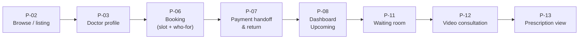
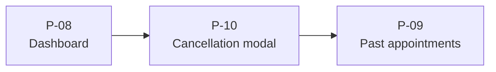
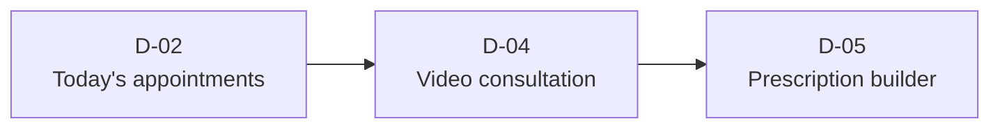

# 06 — Design System & Theme Document

| Field | Value |
|---|---|
| Document ID | `06-DESIGN_SYSTEM_THEME_DOCUMENT` |
| Status | Canonical |
| Version | 1.0 |
| Last updated | 2026-06-01 |
| Sources absorbed | `docs/design/DESIGN.md; mockups/assets/css/tokens.css; mockups/assets/css/components.css` |
| Related docs | 02, 03 |

---

## Index

1. [Screen flows](#1-screen-flows)
2. [Navigation structure](#2-navigation-structure)
3. [Key interactions](#3-key-interactions)
4. [Color palette](#4-color-palette)
5. [Typography](#5-typography)
6. [Spacing & layout](#6-spacing--layout)
7. [Component behavior](#7-component-behavior)

---

## Purpose

This document is the single-source canonical reference for the Dermestha visual design system and theme. It faithfully re-presents the design principles, screen inventory, tokens, and component conventions from `DESIGN.md`, `tokens.css`, and `components.css` so that any developer, designer, or agent can implement or audit the UI against one document. No facts are invented — every value is copied verbatim from the authoritative sources.

---

## 1. Screen flows

### Core interaction pattern

The dominant app flow is: **list → filter → select → confirm → state feedback**. This pattern governs booking, cancellation, prescription, and admin catalogue management.

### Patient booking flow

### Cancellation sub-flow

### Doctor consultation flow

### Reusable building blocks

- **Stepper** — linear progress indicator (Select slot → Who for → Pay) used in booking (P-06) and reset/onboarding flows.
- **Form section card** — white card with section title, grouped fields, and footer actions; backbone of booking, the prescription builder, and all admin forms.
- **Status badge** — squared (3 px), dot-less, semantic tint+text; appears in dashboards, listings, and admin tables.
- **Empty state** — centered icon + short message + primary CTA; used in P-08 ("No upcoming appointments — Browse doctors"), empty listing, and empty search.
- **Confirmation modal** — centered card on dimmed backdrop; used for cancellations (P-10), doctor cancel (D-06), admin deactivation (A-01).

---

## 2. Navigation structure

### Three surfaces

| Surface | Primary audience | Nav chrome | Breakpoint behaviour |
|---|---|---|---|
| Patient | Patients (responsive web) | Top nav (desktop/logged-out) + bottom tab bar (mobile/logged-in) | Bottom tabs below 767 px → top nav at ≥ 768 px |
| Doctor | Doctors (desktop-first) | Fixed left sidebar (240 px) + content header | Collapses to off-canvas drawer (hamburger) on mobile |
| Admin | Administrators (desktop) | Fixed left sidebar (240 px) | Collapses to drawer on mobile; tables scroll horizontally |

### Patient nav routes

| Route context | Links |
|---|---|
| Public / logged-out | Browse, How it works, For doctors — Login (secondary button) |
| Logged-in | Browse / Appointments / Profile (bottom tabs on mobile; top nav on desktop) |

### Doctor sidebar links

Today — Availability (weekly grid) — History

### Admin sidebar links

Doctors — Medicines — Alerts — Records & Audit — Settings

### Screen-to-route inventory

| Screen ID | Screen name | Surface | PRD ref |
|---|---|---|---|
| P-01 | Landing | Patient (public) | — |
| P-02 | Doctor listing / Browse | Patient | P1 |
| P-03 | Doctor profile | Patient | P1 |
| P-04 | Sign up | Patient | P2 |
| P-05 | Login + password recovery | Patient / Doctor / Admin | P2, DA2 |
| P-06 | Booking (slot + who-for) | Patient | P3, P8 |
| P-07 | Payment handoff & return | Patient | P3, edge #6a |
| P-08 | Dashboard — Upcoming | Patient | P9 |
| P-09 | Dashboard — Past appointments | Patient | P7 |
| P-10 | Cancellation modal | Patient | P6 |
| P-11 | Pre-call waiting room | Patient | P5 |
| P-12 | Video consultation | Patient | P5 |
| P-13 | Prescription view + PDF | Patient | P7, §3.5 |
| D-01 | Forced first-login password change | Doctor | DA3 |
| D-02 | Today's appointments + History | Doctor | D2 |
| D-03 | Weekly availability grid | Doctor | D1 |
| D-04 | Video consultation (doctor) | Doctor | D3 |
| D-05 | Prescription builder | Doctor | D4 |
| D-06 | Cancel appointment modal | Doctor | D5 |
| A-01 | Doctors — list / add / edit / deactivate | Admin | A1, A4 |
| A-02 | Medicine catalogue | Admin | A2 |
| A-03 | Alert feed / system health | Admin | A3 |
| A-04 | Records & Audit Log | Admin | A5 |
| A-05 | Settings | Admin | A6 |

---

## 3. Key interactions

### Form validation

- **Text input** default border uses `border-strong`; on focus the border switches to spruce (`color-primary`) with a `0 0 0 3px rgba(15,58,42,.15)` ring.
- Error state: `color-danger` border, `color-danger-deep` helper text below the field.
- Label sits above the field in Archivo label-case 12 px (`.field > label`).
- Helper text and error text both use `fs-caption` (12 px); helper in `color-text-muted`, error in `color-danger-deep`.

### Mandatory consent checkbox (P-04)

Submit is blocked until the patient checks the ToS/Privacy consent checkbox. The checkbox uses spruce `accent-color`; the field copy includes inline links to `/legal/terms` and `/legal/privacy`.

### Slot selection (P-06)

Slots are grouped under day tabs. States:
- `available` — white fill, green hairline (`color-primary-border`), cursor pointer.
- `selected` — spruce fill (`color-primary`), white text, no shadow.
- `disabled/booked` — sunken fill, struck-through label (`text-decoration: line-through`), not-allowed cursor.
- `locked` — sunken fill, muted text, not-allowed cursor (held during another patient's payment).

Minimum tap target: ≥ 44 px tall. Time labels use tabular numerics.

### Confirmation dialogs (modals)

Centered on a dimmed backdrop (`rgba(15,33,24,.45)`). A 4 px accent bar at the top is colored by intent: spruce for confirmations, danger red for cancellations and deactivation. Actions are right-aligned: ghost "cancel" + filled "confirm". Never left-aligned in a content column.

### Payment flow states (P-07)

Returned as finished centered cards (~520 px, icon circle + title + body + single action):
- **Success** — confirmed → redirect to dashboard.
- **Failure** — retry within lock window.
- **Lock expired** — "slot released — please pick another".
- **Platform couldn't secure slot** — full refund message.

### Join Call activation (P-08 / D-02)

"Join Call" button is disabled until 10 minutes before the appointment slot.

### Video slot timer and cutoff (P-12 / D-04)

A slot timer is visible throughout the call. A soft "5 minutes remaining" warning appears on the doctor's view. The hard cutoff is slot-end + 5 minutes.

### Prescription immutability (D-05)

"Submit" makes the prescription immutable. Corrections require a new prescription; all prescriptions are shown chronologically, each downloadable.

### Appointment cancellation modals

- ≥ 2 h before: refund breakdown (paid − gateway fee = refund) with "excludes gateway fee" note → "Cancel & refund".
- < 2 h before: warning ("No refund; the slot stays blocked") → confirm.

### Appointment state → badge mapping

| Underlying state | Patient-facing label | Badge variant |
|---|---|---|
| `confirmed` | Confirmed | success |
| `in_progress` | In progress | info |
| `completed` / `prescription_issued` | Completed · Prescription ready | success |
| `cancelled_refunded` | Cancelled — refunded | info |
| `cancelled_no_refund` | Cancelled — no refund | neutral |
| `doctor_cancelled` / `doctor_no_show` | Cancelled by doctor — refund issued | danger |
| `patient_no_show` | Missed (no-show) | warning |
| `awaiting_prescription` (derived) | Awaiting prescription | warning |
| `disputed` (admin only) | Disputed | danger outline marker, orthogonal to state |

### System banner

Full-width strip below the nav for system states (payment-aggregator outage, video-provider outage). Uses `warning`/`danger` tint. Dismissible where safe.

### Toast notifications

Top-right, `shadow-overlay`, auto-dismiss. Used for transient confirmations. Variants: success / info / warning / danger (semantic tint + 1 px border + icon).

### Motion

Hover and dialog transitions: 150–200 ms ease. One staggered reveal allowed on the landing hero. Honors `prefers-reduced-motion` (`--ease` collapses to `0ms`).

---

## 4. Color palette

All hex values are copied verbatim from `mockups/assets/css/tokens.css`.

### Brand

| Token | Value | Use |
|---|---|---|
| `--color-primary` | `#0F3A2A` | Deep spruce — primary buttons, links, headings, brand |
| `--color-primary-hover` | `#0A2C20` | Hover / pressed state |
| `--color-primary-tint` | `#E6F1EA` | Subtle green fill (success bg, selected rows, sidebar active) |
| `--color-primary-border` | `#C2D3C8` | Green hairline (e.g., available slot outline) |
| `--color-on-primary` | `#FFFFFF` | Text/icons on spruce backgrounds |

### Accent (brass — use sparingly)

| Token | Value | Use |
|---|---|---|
| `--color-accent` | `#B5852F` | Brass — next-slot highlight, small flourishes, large/bold text only |
| `--color-accent-deep` | `#9A6B1F` | Brass for small text (meets AA on white/porcelain) |
| `--color-accent-tint` | `#FBF0E0` | Warning/awaiting background |

### Surface / canvas / ink

| Token | Value | Use |
|---|---|---|
| `--color-bg` | `#E8ECE9` | App canvas (cool porcelain) — functional screens |
| `--color-surface` | `#FFFFFF` | Cards, inputs, sheets |
| `--color-surface-sunken` | `#DFE5E1` | Wells, disabled fills |
| `--color-border` | `#D7DED8` | Default 1 px hairline |
| `--color-border-strong` | `#C2CBC4` | Emphasised border / default input border |
| `--color-text-strong` | `#13241D` | Headings, key values |
| `--color-text-body` | `#46524B` | Body copy |
| `--color-text-muted` | `#56625B` | Metadata, secondary labels |

### Feature dark band

| Token | Value | Use |
|---|---|---|
| `--color-feature-bg` | `#0F3A2A` | Deep green section background (landing hero, footer, auth panel) |
| `--color-on-dark` | `#DCE9E2` | Body text on green |
| `--color-on-dark-muted` | `#AFC6BA` | Secondary text on green |
| `--color-on-dark-accent` | `#9BE3B8` | Mint highlight on green (eyebrows, accents, video "live" indicator) |

### Dark / immersive chrome (video stage + waiting room)

| Token | Value | Use |
|---|---|---|
| `--color-dark-bg` | `#0A2C20` | Video stage / camera-preview background (deep spruce) |
| `--color-dark-surface` | `#0E3328` | Self-tile / inset surface on dark |
| `--color-dark-border` | `#1F5440` | Hairline on dark surfaces |
| `--color-dark-deep` | `#072018` | Full-bleed immersive page background (video consultation screen) |

### Semantic / status

| Token | Text value | Background value | Use |
|---|---|---|---|
| success | `#136B45` | `#E6F1EA` | Confirmed, completed, prescription ready |
| info | `#2F6E6E` | `#E2EFEE` | In progress, cancelled–refunded |
| warning | `#9A6B1F` | `#FBF0E0` | Missed/no-show, awaiting prescription |
| danger | `#B23A2E` | `#F7E9E6` | Doctor-cancelled, destructive actions, errors |
| danger-deep | `#9A2A20` | — | Error text needing higher contrast |
| neutral | `#56625B` | `#EAEEEA` | Cancelled–no-refund, generic |

### Contrast guardrails

- `--color-accent` (`#B5852F`) is ~3.4:1 on white — use only for non-text accents or ≥ 18 px/bold text; use `--color-accent-deep` for small text.
- All `--color-text-*` roles meet AA on both `--color-bg` and `--color-surface`.
- White on `--color-primary` meets AA.

---

## 5. Typography

### Font stack

| Role | CSS variable | Full stack |
|---|---|---|
| Headings / display / labels | `--font-head` | `"Archivo", system-ui, -apple-system, "Segoe UI", Roboto, sans-serif` |
| Body / UI | `--font-body` | `"Hanken Grotesk", system-ui, -apple-system, "Segoe UI", Roboto, sans-serif` |

**Loading:** Google Fonts with `preconnect` + `display=swap`. Limit to Archivo weights 700 and 800; Hanken Grotesk weights 400, 500, 600, and 700.

### Type scale

Values from `tokens.css`; line heights, weights, and tracking from `DESIGN.md §2.2`.

| Role | CSS variable | Size | Line height | Weight | Family | Tracking |
|---|---|---|---|---|---|---|
| display | `--fs-display` | 30 px (→ 40 px desktop) | 1.1 | 800 | Archivo | −0.8 px |
| h1 | `--fs-h1` | 24 px (→ 26 px desktop) | 1.15 | 800 | Archivo | −0.6 px |
| h2 | `--fs-h2` | 20 px | 1.2 | 700 | Archivo | −0.4 px |
| h3 | `--fs-h3` | 17 px | 1.3 | 700 | Archivo | −0.3 px |
| body-lg | `--fs-body-lg` | 16 px | 1.55 | 400 | Hanken | 0 |
| body | `--fs-body` | 14 px | 1.55 | 400 | Hanken | 0 |
| body-sm | `--fs-body-sm` | 13 px | 1.5 | 400 | Hanken | 0 |
| caption | `--fs-caption` | 12 px | 1.4 | 500 | Hanken | 0 |
| label | `--fs-label` | 11 px | 1.2 | 700 | Archivo | +0.8 px, UPPERCASE |

### Usage rules

- **Headings / display / labels:** Archivo 700–800. Tight tracking on large sizes.
- **Body / UI text:** Hanken Grotesk 400–700.
- **No monospace.** Money, times, counts, and reference numbers use `font-variant-numeric: tabular-nums` (`.tnum` utility class) in Hanken for column alignment.
- `.label` class adds `text-transform: uppercase` and `letter-spacing: .8px`.

### Logo / wordmark

"Dermestha" wordmark: Archivo 800, −0.6 px tracking. Square mark: spruce rounded square (7 px radius) with a brass dot top-right. The square mark is the favicon / app icon / mobile header lockup.

---

## 6. Spacing & layout

### Spacing scale (4 px base)

| Token | Value |
|---|---|
| `--sp-1` | `4px` |
| `--sp-2` | `8px` |
| `--sp-3` | `12px` |
| `--sp-4` | `16px` |
| `--sp-5` | `20px` |
| `--sp-6` | `24px` |
| `--sp-8` | `32px` |
| `--sp-10` | `40px` |
| `--sp-12` | `48px` |
| `--sp-16` | `64px` |

### Border radius

| Token | Value | Applied to |
|---|---|---|
| `--r-sm` | `3px` | Buttons, controls, badges, PMC badge, slots |
| `--r-md` | `4px` | Cards, inputs, tables |
| `--r-lg` | `6px` | Modals, sheets, video stage |
| `--r-pill` | `999px` | Avatars only |

### Borders and elevation

- Default border: `1px solid var(--color-border)` (`--border-1`).
- Strong border: `1px solid var(--color-border-strong)` (`--border-strong`).
- **Flat by default.** Structure is carried by borders, not shadows.
- Overlay shadow (`--shadow-overlay`): `0 18px 44px rgba(15,33,24,.25)` — modals, menus, toasts only.
- Sticky bars use a `1px` divider, not a drop shadow.

### Layout tokens

| Token | Value | Use |
|---|---|---|
| `--maxw` | `1240px` | Content max-width for the `.container` helper |
| `--sidebar-w` | `240px` | Fixed left sidebar (doctor / admin layouts) |

### Breakpoints

| Breakpoint | Range | Patient nav | Doctor card grid |
|---|---|---|---|
| mobile | < 640 px | bottom tab bar | 1 column |
| tablet | 640–1023 px | bottom tab bar (≤ 767) → top nav (≥ 768) | 2 columns |
| desktop | ≥ 1024 px | top nav | 3 columns |

Content max-width ~1100 px, centered, 16–24 px gutters. Mobile content padding collapses from `--sp-6` to `--sp-4`.

### Layout patterns

- **Split-auth** (`.auth-split`): two-pane grid (`1.05fr 1fr`), full-height spruce brand panel beside the form (max 400 px). Collapses to single column with compact centered brand lockup below 860 px.
- **Document "paper"** (`.rx-paper`): prescription renders as a ~920 px centered document card with a 3 px brass top accent and clinic-lockup header.
- **Centered status card**: payment return states use centered constrained (~520 px) cards.
- **Sidebar content fills the width**: on doctor/admin layouts, page content uses `width: 100%` with no max-width cap. The only fixed-width element is a modal.
- **Full-bleed brand surfaces**: spruce panels/bands fill space rather than leaving large empty margins. The top nav is full-width.

---

## 7. Component behavior

All components reference token variables exclusively — no raw hex in `components.css`.

### Button (`.btn`)

Variants, sizes, and states from `components.css`:

| Variant class | Background | Text color | Border |
|---|---|---|---|
| `.btn--primary` | `var(--color-primary)` | `var(--color-on-primary)` | none |
| `.btn--secondary` | `var(--color-surface)` | `var(--color-primary)` | inset 1 px `var(--color-border-strong)` |
| `.btn--ghost` | transparent | `var(--color-primary)` | none |
| `.btn--danger` | `var(--color-danger)` | `#fff` | none |
| `.btn--brass` | `var(--color-accent)` | `#fff` | none |
| `[disabled]` / `.btn--disabled` | `var(--color-surface-sunken)` | `#9AA69E` | none |

Size modifiers: `.btn--sm` (`8 px 14 px`), default (`11 px 18 px`), `.btn--lg` (`13 px 22 px`). `.btn--block` expands to full width. Radius: `--r-sm`. Label: Hanken 700. Hover: `background: var(--color-primary-hover)` on `.btn--primary`. Focus ring: `0 0 0 3px rgba(15,58,42,.30)`. Transition: `background var(--ease)`.

### Text input / textarea (`.input`)

- Padding `10 px 12 px`, border `var(--border-strong)`, radius `var(--r-md)`.
- Focus: `border-color: var(--color-primary)`, ring `0 0 0 3px rgba(15,58,42,.15)`.
- Error: `.input--error` sets `border-color: var(--color-danger)`; `.error-text` renders error message in `var(--color-danger-deep)`.
- Label (`.field > label`): Archivo 700, `var(--fs-caption)`, `var(--color-text-strong)`.
- Helper (`.help`): `var(--fs-caption)`, `var(--color-text-muted)`.
- Max-width `360px` per `.field`; auth forms override to `max-width: none`.

### Select / picker

Native-styled `<select>` for simple cases; custom keyboard-navigable listbox for medicine search (D-05) and day/slot selection (P-06).

### Checkbox & radio (`.choice`)

`display: flex`, 18 × 18 px input, `accent-color: var(--color-primary)`. Checkbox (3 px radius): mandatory ToS/Privacy consent (P-04). Radio (circular): "Who is this consultation for?" (P-06).

### Avatar (`.avatar`)

Circular (`border-radius: var(--r-pill)`), `object-fit: cover`. Background `var(--color-primary-tint)`, initials text `var(--color-primary)`.

| Size class | Dimensions | Font size |
|---|---|---|
| `.avatar--sm` | 28 × 28 px | 11 px |
| `.avatar--md` | 34 × 34 px | 12 px |
| `.avatar--lg` | 48 × 48 px | 16 px |

### Doctor card (`.doc-card`) — signature component

- Anatomy: photo area (140 px height, `object-position: center 20%`) with PMC badge overlay → name (Archivo 700, `var(--color-primary)`) → specialization + years (caption, muted) → divider → footer row: fee (`var(--color-text-strong)`, tabular) + next slot (`var(--color-accent-deep)`, tabular).
- PMC badge (`.pmc-badge`): white pill (`var(--color-surface)`), 1 px spruce border, 10 px bold text, radius `var(--r-sm)`, positioned `top: 10px; right: 10px`.
- Variants: `listing` (grid), `featured` (landing hero side), `compact` (dashboard rows, horizontal). Entire card is the tap target.

### Time-slot button (`.slot`)

- Base: white fill, 1 px `var(--color-primary-border)` inset shadow, Hanken 700, `11 px 14 px` padding, `min-height: 44 px`, radius `var(--r-sm)`.
- `.slot--selected`: `var(--color-primary)` background, white text, no shadow.
- `.slot--disabled`: sunken fill (`var(--color-surface-sunken)`), `#9AA69E` text, struck-through, not-allowed cursor.
- `.slot--locked`: sunken fill, `var(--color-text-muted)` text, not-allowed cursor.

### Status badge (`.badge`)

Radius `var(--r-sm)` (3 px), no dot, `var(--fs-label)` (11 px), Archivo 700, `4 px 9 px` padding, `letter-spacing: .2px`.

| Class | Background | Text |
|---|---|---|
| `.badge--success` | `var(--color-success-bg)` | `var(--color-success)` |
| `.badge--info` | `var(--color-info-bg)` | `var(--color-info)` |
| `.badge--warning` | `var(--color-warning-bg)` | `var(--color-warning)` |
| `.badge--danger` | `var(--color-danger-bg)` | `var(--color-danger)` |
| `.badge--neutral` | `var(--color-neutral-bg)` | `var(--color-neutral)` |

### Modal / dialog (`.modal`)

- Backdrop: `rgba(15,33,24,.45)`, fixed full-screen, flex-centered.
- Card: max-width 360 px, radius `var(--r-lg)`, `var(--shadow-overlay)`, white background, overflow hidden.
- Accent bar (`.modal__accent`): 4 px height, default spruce (`var(--color-primary)`). `.modal__accent--danger` overrides to `var(--color-danger)`.
- Body padding: `var(--sp-5)` (20 px).
- Actions: right-aligned, gap `var(--sp-2)`, margin-top `var(--sp-4)`.

### Inline alert (`.alert`)

Padding `var(--sp-3)`, radius `var(--r-md)`, `var(--fs-body-sm)`. Each variant applies semantic tint background + border + text color. `.alert--danger` uses `var(--color-danger-deep)` for text (higher contrast).

### System banner (`.banner`)

Full-width (`width: 100%`), `var(--sp-3) var(--sp-4)` padding, `var(--fs-body-sm)`, centered text, weight 600. Variants: `.banner--warning` and `.banner--danger`.

### Navigation — top nav (`.topnav`)

White background, 1 px bottom border. Brand mark: 22 × 22 px spruce rounded square (6 px radius) with a brass dot (`var(--color-accent)`, 7 × 7 px, `top: 4px; right: 4px`). Wordmark: Archivo 800, `var(--fs-h2)`, `var(--color-primary)`, −0.6 px tracking. Nav links: 13 px, weight 600, muted; active link in `var(--color-primary)`. Standard white chrome on every screen — chrome never changes color per page.

### Navigation — bottom tab bar (`.tabbar`)

Fixed bottom, white background, 1 px top border. Items: Archivo 9 px 700, default color `#A6B0AA`, active in `var(--color-primary)`. Three routes: Browse / Appointments / Profile. Shown only on mobile (`.only-mobile`).

### Navigation — sidebar (`.sidebar`)

Width `var(--sidebar-w)` (240 px), white background, 1 px right border, `var(--sp-4)` padding. Links (`.sidebar__link`): 13 px, weight 600, default `var(--color-text-body)`. Active: `background: var(--color-primary-tint)`, `color: var(--color-primary)`. Content area (`.content`): `flex: 1`, `padding: var(--sp-6)`; on mobile collapses to `padding: var(--sp-4)`.

### Table / data row (`.table`) — admin

Full-width, `border-collapse: collapse`, white background, `var(--border-1)`, radius `var(--r-md)`. Header: Archivo label-case, 11 px, uppercase, `letter-spacing: .6px`, muted text, `12 px 14 px` padding. Cells: 13 px, `12 px 14 px` padding, bottom border; last row has no bottom border. Row hover: `background: var(--color-bg)`. Numeric cells: right-aligned tabular. Filter bar above table using `.filters` (flex-wrap, gap `var(--sp-2)`).

### Form section card (`.section-card`)

White background, `var(--border-1)`, radius `var(--r-md)`, `var(--sp-5)` padding, `margin-bottom: var(--sp-4)`. Section title has `margin-bottom: var(--sp-4)`.

### Stepper (`.stepper`)

Flex row, gap `var(--sp-2)`, `margin-bottom: var(--sp-5)`. Step number: 22 × 22 px circle, default sunken fill + muted text. Active step: spruce fill + white text; step label in `var(--color-primary)`. Upcoming: muted. "Done" step shows a check mark.

### Prescription line-item (`.rx-item`) — signature component

- Row: `justify-content: space-between`, `padding: var(--sp-3) 0`, bottom border.
- Left: medicine name (`.rx-item__name`, weight 700, `var(--color-text-strong)`) + dosage/duration/instructions (`.rx-item__detail`, 13 px, muted).
- Right: price (`.rx-item__price`, tabular, weight 700, `var(--color-text-strong)`).
- Unpriced tag (`.tag-unpriced`): neutral tint background + neutral text, 11 px 700, `2 px 7 px` padding, radius `var(--r-sm)`.
- Total row (`.rx-total`): Archivo 800, `var(--color-primary)`, `padding-top: var(--sp-3)`.

### Video chrome — stage, self-tile, controls

- Stage (`.video-stage`): `var(--color-dark-bg)` background, radius `var(--r-lg)`, `aspect-ratio: 16/9`, text color `var(--color-on-dark)`.
- Self-tile (`.video-self`): `120 px` wide, `aspect-ratio: 4/3`, `var(--color-dark-surface)` bg, radius `var(--r-md)`, 1 px `var(--color-dark-border)` border; positioned `bottom: 12px; right: 12px`.
- Controls (`.video-controls`): flex row, gap `var(--sp-3)`, centered, `margin-top: var(--sp-4)`.
- Control button (`.video-ctrl`): 48 × 48 px circle, white bg, `var(--border-strong)`.
- Leave button (`.video-ctrl--leave`): `var(--color-danger)` bg, white text, no border.

### Feature dark band (`.feature`)

Background `var(--color-feature-bg)`, text `var(--color-on-dark)`. Headings override to `#fff`. Muted text uses `var(--color-on-dark-muted)`. Eyebrow label: Archivo 700, 11 px, `letter-spacing: 1.3px`, uppercase, `var(--color-on-dark-accent)`.

### Split auth layout (`.auth-split`)

Grid `1.05fr 1fr`, min-height 100 vh. Brand panel: `var(--color-feature-bg)` bg, 48 px padding. Brand mark in panel: 26 × 26 px, 7 px radius, `var(--color-on-dark-accent)` bg with brass dot. Headline: Archivo 800, 30 px, −0.6 px tracking, white. Form side: `var(--color-bg)` background, centered, max 400 px form. Below 860 px: panel hidden, single-column layout with compact centered mobile brand lockup.

### Empty state (`.empty`)

Centered, `padding: var(--sp-12) var(--sp-4)`, `var(--color-text-muted)`. Icon: 40 × 40 px, `var(--color-border-strong)` color. Message + primary CTA follow.

### Card utility (`.card`)

`background: var(--color-surface)`, `border: var(--border-1)`, `border-radius: var(--r-md)`. The base card primitive used by section cards, doctor cards, and form containers.

---

## Revision footer

| Date | Change | Why |
|---|---|---|
| 2026-06-01 | Initial creation | Faithful re-presentation of DESIGN.md + tokens.css + components.css |
