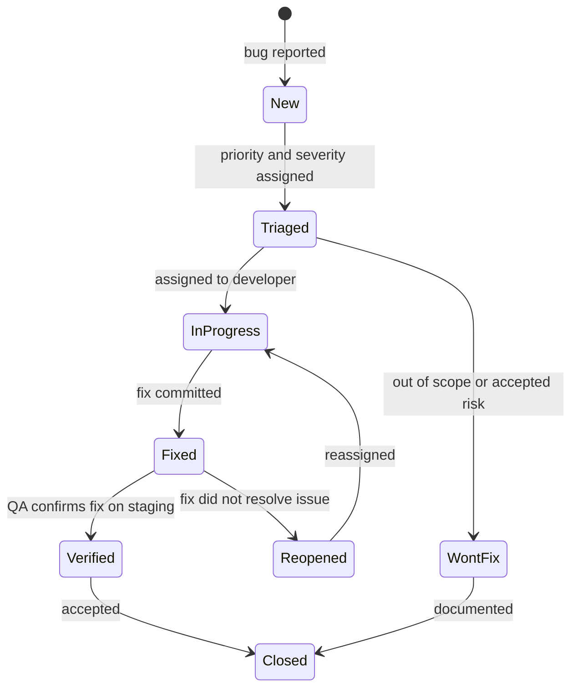

# 09 — Dev Testing & QA Testing Document

| Field            | Value                                             |
| ---------------- | ------------------------------------------------- |
| Document ID      | `09-DEVTESTING_QATESTING_DOCUMENT`                |
| Status           | Canonical                                         |
| Version          | 1.2                                               |
| Last updated     | 2026-06-01                                        |
| Sources absorbed | `docs/specification/02, 04, 08; vitest.config.js` |
| Related docs     | 02, 04, 08, 12                                    |

---

## Index

1. [Purpose](#purpose)
2. [Testing strategy](#1-testing-strategy)
3. [Test scope](#2-test-scope)
4. [Test environments](#3-test-environments)
5. [Test types](#4-test-types)
6. [Test case structure](#5-test-case-structure)
7. [Bug lifecycle](#6-bug-lifecycle)
8. [Entry and exit criteria](#7-entry-and-exit-criteria)
9. [Definition of Done](#8-definition-of-done)
10. [Test reporting](#9-test-reporting)
11. [Revision footer](#revision-footer)

---

## Purpose

This document defines the testing strategy, scope, environments, case structure, bug lifecycle, and release criteria for Dermestha v1. It is derived entirely from the feature catalogue and acceptance criteria in doc 02, the data-integrity invariants in doc 04, and the security controls in doc 08. The actual enumerated test cases (one per acceptance criterion) are maintained in doc 12.

---

## 1. Testing strategy

The v1 testing programme spans four layers.

**Unit testing** covers isolated service-layer logic: the appointment state-machine transition table (now merged into `server/src/modules/appointment/service.js`), the ten data-integrity invariants from doc 04, password hashing, Zod schema validation, role middleware, and audit-service record emission. The runner is **Vitest** (root `vitest.config.js`, `environment: 'node'`, globs `server/src/**/*.test.js` + `server/src/**/test.js` — the co-located domain-module tests — plus `shared/**/*.test.js`). A separate client-side Vitest config (`client/vitest.config.js`, `environment: 'jsdom'`) runs the React component/view tests, co-located beside each unit (e.g. `client/src/modules/<feature>/views/<View>/<View>.test.jsx`, `client/src/shared/<Name>/<Name>.test.jsx`).

**Integration testing** covers the live application stack: Express routes exercised against a real PostgreSQL instance (using the `DATABASE_URL` env var loaded via Vite's `loadEnv`). The same Vitest runner and config are used. Integration test files live under `server/src/test/`.

**QA functional testing** covers the complete user-facing flows for all 16 features (F01–F16) on the deployed staging environment. Tests are executed manually (or via assisted browser automation) against the 24 defined screens. Each test case maps to one or more acceptance criteria from doc 02.

**User acceptance testing (UAT)** is conducted by the client (patient-side) and a designated doctor representative at the end of each milestone (M1 slot booking, M2 payment and calls, M3 prescription and admin, M4 legal content and notifications). Sign-off at each milestone is required before the next milestone begins.

---

## 2. Test scope

### In scope — v1 features

All sixteen features defined in doc 02 are in scope for v1 testing:

1. F01 — Patient authentication & account
2. F02 — Doctor discovery (public listing & profile)
3. F03 — Slot booking & slot-lock
4. F04 — Payment
5. F05 — Appointment lifecycle & video consultation
6. F06 — Cancellation & refund
7. F07 — Reminders & notifications
8. F08 — Prescription
9. F09 — Doctor weekly availability
10. F10 — Admin: doctor onboarding, edit, (de)activation
11. F11 — Admin: medicine catalogue
12. F12 — Admin: system-health alerts
13. F13 — Admin: records & audit log (unified)
14. F14 — Admin: platform settings
15. F15 — Doctor & admin authentication & roles
16. F16 — Legal content (ToS / Privacy)

### Out of scope — deferred items

The following items are explicitly excluded from v1 testing:

- **Medicine Ordering Module** (F-MO1, F-MO2 and associated order state machine) — deferred from v1 per doc 02 §5. Neither `orders` nor `order_items` tables are modeled in the v1 schema.
- **Email verification flow** — deferred to v1.1 per F01.04.
- **Patient account deletion and data-export flows** — deferred to v1.1 per doc 08 §4.3.
- **Policy versioning and re-consent prompts** — deferred to v1.1 per F01.01 and F16.02.
- **WCAG conformance testing** — no WCAG target is set for v1 per doc 08 §4.4.
- **Courier API integration** — no integration exists; the Medicine Ordering module is out of scope.
- **Live-queue / on-demand booking** (removal of minimum lead time) — v1.1 per F03.01.
- **SMS / WhatsApp notifications** — out of scope per F07.04.
- **PDF prescription email attachment** — out of scope per F07.04 and F08.01.

---

## 3. Test environments

### Development (local)

The local development environment is defined by the repo's `docker-compose` setup: an application container and a PostgreSQL container. Developers run Vitest directly against this stack. The `DATABASE_URL` env var must point to the local Postgres instance; `.env.example` is the documented contract (doc 08 §A05). Integration tests that require a live database use this environment.

Third-party integrations use test/sandbox modes:

- **Payment (PayFast):** the `PAYFAST_*` env vars toggle the adapter to sandbox mode; no live charges are possible in development (doc 08 §A05).
- **Video (Daily):** test rooms are created via the `DAILY_API_KEY` pointing to a Daily test project; no real call traffic is billed.
- **Email (Resend):** test sends do not deliver to real inboxes; Resend's test mode or a test API key is used.

### Staging

Staging is a Railway-hosted deployment running the production Docker image against a separate Railway-managed PostgreSQL instance. Migrations must be applied before QA functional testing begins. Third-party integrations remain in sandbox/test mode on staging unless a controlled live-test is explicitly authorised.

Deployment details are cross-referenced in doc 10; this document does not duplicate them.

---

## 4. Test types

**Functional testing** validates that each acceptance criterion defined in doc 02 is met for features F01–F16. Every named rule (e.g., Slot-Lock Rule, Free-Cancel Window Rule, Room-Isolation Rule) constitutes a testable criterion. Test cases are enumerated in doc 12 using the `TC-<Feature>-<Seq>` format defined in §5 below.

**Regression testing** is run after each bug fix or feature change. The full Vitest unit and integration suite is executed to confirm that no previously passing criterion has regressed. QA functional regression is scoped to the feature areas touched by the change plus any features with shared dependencies (e.g., state machine, payment flow, audit log).

**Basic security testing** verifies the controls documented in doc 08. This includes: rate-limit and account-lockout thresholds from doc 08 §A07; enumeration-safe response shapes on login and forgot-password; role-boundary enforcement (patient/doctor/admin routes reject out-of-role requests per DA6); webhook signature rejection for missing or invalid signatures per doc 08 §A08; and cookie attributes (HTTP-only, Secure, SameSite=Lax). Security tests do not constitute a penetration test and do not certify regulatory compliance — both are deferred per doc 08 §4.1.

**Data-integrity testing** exercises the ten invariants enumerated in doc 04 (tracing to PRD §3.3). Each invariant maps to one or more test cases:

| Invariant | Description                                                                                                              |
| --------- | ------------------------------------------------------------------------------------------------------------------------ |
| #1        | Slot double-booking is impossible — partial unique index `uniq_active_slot` rejects the second insert                    |
| #2        | Booking confirmation and payment record commit atomically — either both persist or neither                               |
| #3        | Doctor rename never alters historical appointments or prescriptions                                                      |
| #4        | Prescription immutability — no update or delete path exists; corrections are new rows                                    |
| #5        | Medicine name, dosage, and price are snapshotted on the prescription at issue-time                                       |
| #6        | `feeAtBooking` is snapshotted at confirmation; later doctor fee changes do not affect existing appointments              |
| #7        | Payment-intent creation is idempotent on `(patient_user_id, slot_start)` — `intent_key` unique constraint                |
| #8        | `pmcNumber` and `User.email` are immutable post-creation for a doctor record                                             |
| #9        | Deactivating a doctor preserves existing confirmed appointments; login is not revoked                                    |
| #10       | Each appointment carries one `refund_idempotency_key`; a second refund settlement for the same appointment is impossible |

---

## 5. Test case structure

### ID format

Test case IDs follow the pattern `TC-<Feature>-<Seq>`, where:

- `<Feature>` is the doc 02 feature ID without the `F` prefix, zero-padded to two digits (e.g., `F03` → `03`).
- `<Seq>` is a three-digit sequence number within the feature (e.g., `001`, `002`).

Examples: `TC-F03-001` (slot picker, future-slots-only rule), `TC-F04-002` (webhook truth rule), `TC-F06-001` (free-cancel window rule).

### Required fields per test case

Each test case in doc 12 must carry the following fields:

| Field           | Description                                                           |
| --------------- | --------------------------------------------------------------------- |
| ID              | `TC-<Feature>-<Seq>`                                                  |
| Feature mapping | The doc 02 feature ID and sub-feature (e.g., `F03.03 Slot-Lock Rule`) |
| Preconditions   | System and data state required before execution                       |
| Steps           | Numbered action sequence                                              |
| Expected result | Observable outcome that constitutes a pass                            |
| Priority        | Critical / High / Medium / Low                                        |

### Priority mapping

Priority is assigned based on flow criticality as defined by the doc 02 feature catalogue:

| Priority | Applies to                                                                                                                                                        |
| -------- | ----------------------------------------------------------------------------------------------------------------------------------------------------------------- |
| Critical | Core booking (F03), payment and webhook (F04), video join (F05), cancellation and refund (F06), data-integrity invariants #1–#10, role-boundary enforcement (F15) |
| High     | Prescription creation and download (F08), doctor availability and slot generation (F09), reminders and notifications (F07), admin doctor management (F10)         |
| Medium   | Medicine catalogue (F11), system-health alerts (F12), records and audit log (F13), platform settings (F14)                                                        |
| Low      | Doctor discovery and public listing (F02), legal pages (F16), UI empty states, copy and label accuracy                                                            |

---

## 6. Bug lifecycle

### Status flow

### Severity definitions

Severity reflects the impact on Dermestha v1 users and data integrity. It is distinct from priority (which determines fix order relative to the release gate).

| Severity | Definition                                                                                                                                                                                                                                                                                                                                                                                        |
| -------- | ------------------------------------------------------------------------------------------------------------------------------------------------------------------------------------------------------------------------------------------------------------------------------------------------------------------------------------------------------------------------------------------------- |
| Critical | Slot double-booking (invariant #1 violation); payment confirmed but appointment not created or vice versa (invariant #2 violation); incorrect refund amount or double-refund (invariants #5, #10); prescription data mutated or lost (invariant #4); patient or doctor can access another user's data (role boundary breach, doc 08 §A01); webhook accepted without valid signature (doc 08 §A08) |
| High     | Video room accessible to the wrong participant; join button not activating at correct time; cancellation window logic incorrect; `feeAtBooking` snapshot not captured; `must_change_password` gate not enforced; rate-limit thresholds not enforced per doc 08 §A07                                                                                                                               |
| Medium   | Reminder email sent for a cancelled appointment; incorrect appointment state label in UI; prescription PDF renders wrong patient identity; audit log entry missing for a required event; admin alert not raised on retry exhaustion                                                                                                                                                               |
| Low      | Cosmetic UI misalignment; copy errors; non-critical link targets wrong; timezone display off by a minute; empty-state message missing                                                                                                                                                                                                                                                             |

---

## 7. Entry and exit criteria

### Entry criteria (start of QA functional testing)

All of the following must be true before QA functional testing begins on staging:

- The build is deployed to the staging environment without errors.
- All Prisma migrations (including the hand-edited `uniq_active_slot` partial unique index from doc 04 §4b) have been applied.
- A smoke pass confirms: the `/login` route responds, the public doctor listing loads at least one doctor, and the PayFast sandbox endpoint is reachable.
- All third-party integrations (Daily, Resend, PayFast) are configured in sandbox/test mode.
- The Vitest unit and integration suite passes with no failures on the build being promoted.
- Test data (at least one active doctor with availability, one patient account, one admin account bootstrapped via the bootstrap script) is present on staging.

### Exit criteria (release gate)

All of the following must be true before promoting to production:

- All Critical and High priority test cases in doc 12 have a Verified pass status.
- No open bugs at Critical or High severity remain.
- All ten data-integrity invariants (#1–#10 from doc 04) have been exercised and verified.
- The Vitest unit and integration suite passes cleanly on the release candidate commit.
- UAT sign-off has been received from the client representative and a designated doctor for the milestone scope (M1–M4 as applicable).
- The audit log is confirmed to record entries for at minimum: a booking confirmation, a cancellation, a payment webhook receipt, and an admin platform settings change.

---

## 8. Definition of Done

A feature is considered complete when all of the following criteria are met:

- [ ] All Vitest unit tests for the feature's service-layer logic pass.
- [ ] All Vitest integration tests for the feature's API routes pass.
- [ ] Every acceptance criterion and named rule from the corresponding doc 02 feature section is covered by a test case in doc 12 with Verified status.
- [ ] All applicable security controls from doc 08 are verified for the feature (e.g., role boundary, rate limit, cookie attributes, webhook signature).
- [ ] All data-integrity invariants that the feature touches (per the doc 04 §6 scope-to-database table) are verified.
- [ ] Audit log entries are emitted for every state transition and admin action defined in doc 08 §A09 that the feature triggers.
- [ ] No open Critical or High severity bugs are linked to the feature.
- [ ] The feature's status in doc 13 (the Architecture Decision Record) is updated to reflect the final implementation decision if a decision was made during development.

---

## 9. Test reporting

### Metrics

Each QA cycle produces the following metrics:

| Metric              | Description                                                                                       |
| ------------------- | ------------------------------------------------------------------------------------------------- |
| Pass rate           | Percentage of test cases with Verified status (Critical, High, Medium, Low broken out separately) |
| Total defects       | Count of bugs filed in the cycle, broken out by severity (Critical / High / Medium / Low)         |
| Open defects        | Count of bugs not yet at Closed or Won't Fix status at cycle end                                  |
| Invariant coverage  | Count of doc 04 invariants #1–#10 with at least one Verified test case                            |
| Regression failures | Count of previously passing test cases that failed in the current cycle                           |

### Defect summary format

Each defect report entry must include: bug ID, title, severity, affected feature (F01–F16), steps to reproduce, observed vs. expected result, and current status. Defects at Critical severity must also record whether the bug involves a data-integrity invariant violation and which invariant.

### Release recommendation format

The release recommendation is a brief document (or structured comment) that states:

1. Total test cases executed / passed / failed / blocked.
2. Open bug counts by severity.
3. List of any Critical or High cases that are not Verified (with justification if release is still recommended — e.g., accepted risk with a known workaround).
4. Confirmation that all ten data-integrity invariants have Verified coverage.
5. UAT sign-off status per milestone.
6. Go / Conditional go / No-go recommendation with rationale.

---

## Revision footer

| Date       | Change           | Why                                          |
| ---------- | ---------------- | -------------------------------------------- |
| 2026-06-01 | Initial creation | Derived from docs 02/04/08 + repo test setup |
| 2026-06-11 | Re-pointed the transition-table ref to `modules/appointment/service.js` (merged) and updated the Vitest glob to include `server/src/**/test.js` + `shared/**/*.test.js` | Folder-structure restructure (ADR-26); domain-module tests are co-located as `test.js` |
| 2026-06-11 | Corrected the stale "no `.test.jsx` files exist yet" clause — the client suite exists and is co-located per unit | Reflect actual client test tree (pre-existing drift, fixed during the restructure pass) |
